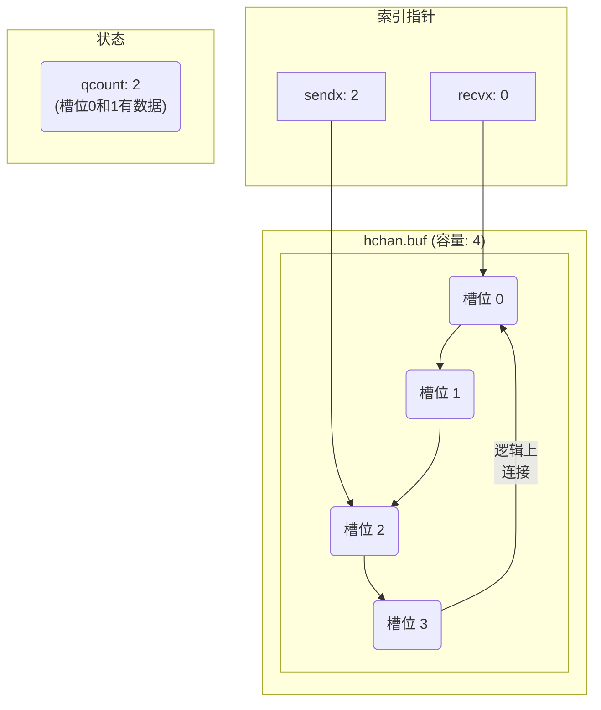

# Go Channel 深度解析

这份文档，旨在从第一性原理出发，层层深入，彻底搞懂Go语言并发编程的核心利器——`channel`的内部实现。

---

### 1. 第一性原理：为什么需要 Channel？

在`channel`出现之前，多线程编程的核心难题，是如何在保证数据一致性的前提下，安全、高效地，在多个执行单元之间，共享数据。这通常，依赖于**共享内存和锁 (Shared Memory and Locks)**。

- **传统模型的困境**: 开发者，需要手动地，使用互斥锁（Mutex）、信号量（Semaphore）等工具，来保护共享数据。这种模型，虽然灵活，但极易出错：
    - **竞态条件 (Race Condition)**: 忘记加锁，或加锁粒度错误，导致数据错乱。
    - **死锁 (Deadlock)**: 多个线程，因互相等待对方持有的锁，而永远阻塞。
    - **复杂性**: 随着业务逻辑变复杂，锁的依赖关系，会变得难以管理和推理，代码可读性和可维护性，急剧下降。

- **Go的哲学：CSP模型**: Go语言，引入了一种不同的并发哲学，源自**通信顺序进程 (Communicating Sequential Processes, CSP)** 模型。其核心思想是：

    > **"Do not communicate by sharing memory; instead, share memory by communicating."**
    > (不要通过共享内存来通信；而要通过通信来共享内存。)

- **Channel的诞生**: `channel`正是这一哲学的具象化体现。它，不是一个数据容器，而是一个**通信管道**。它，将“数据”和“同步”这两个概念，优雅地，绑定在了一起。通过`channel`发送和接收数据，本身，就包含了同步的语义，从而，将开发者，从复杂的锁管理中，解放出来。

--- 

### 2. `hchan`：Channel的内在结构

在Go的`runtime`中，每一个`channel`，都由一个`hchan`结构体来表示。它，定义了`channel`的所有核心属性和状态。

```go
type hchan struct {
	qcount   uint           // channel队列中当前元素个数
	dataqsiz uint           // channel队列的容量 (环形队列的大小)
	buf      unsafe.Pointer // 指向环形队列的指针
	elemsize uint16         // channel中元素的大小
	closed   uint32         // channel是否被关闭
	elemtype *_type         // channel中元素的类型
	sendx    uint           // 发送操作在环形队列中的索引
	recvx    uint           // 接收操作在环形队列中的索引

	recvq    waitq          // 等待接收数据的goroutine队列 (链表)
	sendq    waitq          // 等待发送数据的goroutine队列 (链表)

	lock mutex            // 保护hchan所有字段的锁
}
```

- **核心组件**: 
    - `buf`: 一个环形队列，用于缓存有缓冲`channel`中的数据。
    - `lock`: 一把互斥锁，用于保护`channel`的并发访问。任何对`channel`的操作（发送、接收、关闭），都必须先获取这把锁。
    - `recvq` 和 `sendq`: 两个等待队列，分别存储了，因`channel`为空（读阻塞）或为满（写阻塞）而被挂起的goroutine。

#### `buf`：环形队列的可视化

`hchan`中的`buf`、`sendx`和`recvx`共同构成了一个经典的**环形队列 (Circular Queue)**。这，是实现有缓冲`channel`的核心。

- **`buf`**: 指向一块连续的内存，被逻辑上，视为一个环。
- **`sendx`**: “生产者”的指针，指向下一个可以**写入**数据的位置。
- **`recvx`**: “消费者”的指针，指向下一个可以**读取**数据的位置。



--- 

### 3. [`makechan`](https://github.com/golang/go/blob/release-branch.go1.24/src/runtime/chan.go#L75-L125)：一个Channel的诞生

当我们在代码中写下 `make(chan int, 10)` 时，`runtime`会调用`makechan`函数，来创建一个`hchan`实例。

当我们在代码中写下 `make(chan *int, 10)` 时，`runtime`会调用`makechan`函数。这个函数内部，有一个基于`channel`特性，进行内存分配策略选择的关键决策点：

```go
func makechan(t *chantype, size int) *hchan {
    elem := t.Elem
    // ...
    var c *hchan
    switch {
    case mem == 0:
        // 容量为0或元素大小为0
        c = (*hchan)(mallocgc(hchanSize, nil, true))
        c.buf = c.raceaddr()
    case !elem.Pointers():
        // 元素不含指针
        c = (*hchan)(mallocgc(hchanSize+mem, nil, true))
        c.buf = add(unsafe.Pointer(c), hchanSize)
    default:
        // 元素含指针
        c = new(hchan)
        c.buf = mallocgc(mem, elem, true)
    }
    // ...
    return c
}
```

- **内存布局优化**: `runtime`并没有，为`hchan`结构体和它的`buf`环形缓冲区，进行两次独立的内存分配。相反，它通过`mallocgc(hchanSize + mem, ...)`，**一次性地，分配了一块连续的大内存**。
    - 这块内存的前`hchanSize`个字节，用于存储`hchan`结构体本身。
    - 紧跟在`hchan`结构体后面的`mem`个字节，则被用作环形缓冲区。
    - 最后，通过`c.buf = add(unsafe.Pointer(c), hchanSize)`这句指针运算，将`hchan`的`buf`字段，指向这块连续内存的正确偏移位置。

- **这么做的好处**: 
    1.  **提高缓存局部性**: `channel`的元数据和它存储的数据，在物理上是连续的，这，极大地，提高了CPU缓存的命中率。
    2.  **减少内存分配次数**: 创建一个`channel`，只需要一次内存分配，降低了GC和内存分配器的压力。

---

### 4. `chansend`：发送操作的逻辑分叉

`chansend`函数的内部逻辑，可以，从第一性原理，推导出来。我现在，想发送一条消息，我，需要兼顾的部分是：**正在等待接收的队列 (`recvq`)**、**FIFO的约束**、**缓冲区的数据 (`buf`)**，以及，**等待发送的队列 (`sendq`)**。

所以，为了，在遵守FIFO约束的前提下，最高效地，完成这次发送，我的决策顺序，必然是：

1.  **最高效**: 首先，检查`recvq`。如果，有接收者，正在等待，我就能，与等待队列头部的、最早到达的接收者，直接“手递手”交付。这，完美，满足了FIFO，且效率最高。
2.  **次高效**: 如果，`recvq`为空，再检查`buf`。如果，缓冲区，有空位，我就，将数据，存入缓冲区。这，保证了，我的数据，会排在已有数据之后，同样，遵守了FIFO。
3.  **最低效**: 如果，`recvq`为空，且`buf`也满了，我，别无选择。为了，遵守FIFO，我，必须，将自己，加入到`sendq`的队尾，排队等待。

`chansend`中的`if-else`分支，正是，这个决策链的直接代码实现。下面，我们，来逐一，审视这些场景。
#### 场景一：接收者正在等待 (直接“手递手”)

[`chansend` chan.go:L229](https://github.com/golang/go/blob/release-branch.go1.24/src/runtime/chan.go#L229)
```go
if sg := c.recvq.dequeue(); sg != nil {
    // ...
    send(c, sg, ep, ...)
    return true
}
```

这是`channel`实现中，**最高效**的一种路径。它意味着，有一个或多个goroutine，因为尝试从这个（当时为空的）`channel`接收数据，而被挂起，并被放入了`recvq`等待队列。

-   **`c.recvq.dequeue()`**: 从等待队列的头部，取出一个等待接收的goroutine (`sg`)。
-   **`send(...)`**: 这个内部辅助函数，**直接将要发送的数据，从当前goroutine的栈上，拷贝到那个等待的goroutine (`sg`) 的栈上**。这个过程，完全绕过了`hchan`的环形缓冲区`buf`，就像是两个goroutine，直接“手递手”地，完成了数据交接。
-   交接完成后，等待的接收者`sg`，会被唤醒，发送方，则根本无需阻塞，直接返回。

#### 场景二：缓冲区未满 (放入缓冲区)

[`chansend` chan.go:L236](https://github.com/golang/go/blob/release-branch.go1.24/src/runtime/chan.go#L236)
```go
if c.qcount < c.dataqsiz {
    // ...
    qp := chanbuf(c, c.sendx)
    typedmemmove(c.elemtype, qp, ep)
    c.sendx++
    if c.sendx == c.dataqsiz {
        c.sendx = 0
    }
    c.qcount++
    return true
}
```

如果，没有等待的接收者（场景一不满足），`runtime`就会，尝试使用缓冲区。

-   **`c.qcount < c.dataqsiz`**: 检查环形队列中，是否还有空间。
-   **`typedmemmove(...)`**: 将要发送的数据，从发送方goroutine的栈上(`ep`)，拷贝到缓冲区的槽位(`qp`)中。
-   **`c.sendx++` 和 `if c.sendx == c.dataqsiz`**: `sendx`索引加一，如果到达了末尾，就绕回到0，实现“环形”效果。
-   整个过程，发送方，也无需阻塞，直接返回。

#### 场景三：阻塞发送 (等待接收者出现)

[`chansend` chan.go:L252](https://github.com/golang/go/blob/release-branch.go1.24/src/runtime/chan.go#L252)
```go
if !block {
    return false
}
```

这个`if !block`判断，是`select`语句实现的关键。`chansend`函数，可以被普通的发送操作（`block=true`）调用，也可以被`select`语句（`block=false`）调用。

-   当`chansend`被一个`select`语句调用，且无法立即完成发送时（场景一和二都失败），这个判断，就会起作用。
-   它，会立即`return false`，告诉上层的`select`执行逻辑：“**嘿，这个发送操作，如果要继续，就得阻塞了，你，去看看，有没有别的选择吧！**”

如果，连`select`的非阻塞路径，都走不通，或者，这是一个普通的、必须完成的发送操作，那么，发送方，就真的，别无选择，只能阻塞自己了。

[`chansend` chan.go:L260-L267](https://github.com/golang/go/blob/release-branch.go1.24/src/runtime/chan.go#L260-L267)
```go
gp := getg()
mysg := acquireSudog()
// ... (设置好mysg，包含要发送的数据等信息)

c.sendq.enqueue(mysg) // 将自己（mysg）加入到发送等待队列

gopark(chanparkcommit, unsafe.Pointer(&c.lock), waitReasonChanSend, traceEvGoBlockSend, 2)
// ...

```

#### `send`：手递手的执行者

[`send`](https://github.com/golang/go/blob/release-branch.go1.24/src/runtime/chan.go#L318)函数，是`chansend`和`chanrecv`内部，专门用来处理“goroutine与goroutine之间直接数据交换”的底层实现。它的核心使命，就是完成“手递手”这个动作。

它，主要做两件大事：

1.  **数据拷贝 (Data Copying)**
    *   它，会找到，那个等待的接收方`G_recv`，想要把数据，存放在哪个内存地址（通常是`G_recv`栈上的一个变量）。
    *   然后，它，调用`memmove`，将要发送的数据，**直接拷贝**到`G_recv`指定的那个内存地址上。
    *   这个过程，**完全绕过了`channel`的`buf`环形缓冲区**，实现了“零拷贝到缓冲区”。

2.  **唤醒接收方 (Waking up the Receiver)**
    *   数据拷贝完成后，它，会调用[`goready(sg.g, 3)`](https://github.com/golang/go/blob/release-branch.go1.24/src/runtime/proc.go#L1028)。
    *   `goready`函数，会，将等待的接收方goroutine，的状态，从`_Gwaiting`，修改为`_Grunnable`，并把它，放回到Go调度器的运行队列中，等待下一次执行。

---

### 5. `chanrecv`：接收操作的逻辑分叉

与`chansend`类似，`chanrecv`的内部逻辑，也可以，从第一性原理，推导出来。我现在，想接收一条消息，我，需要兼-顾的部分是：**正在等待发送的队列 (`sendq`)**、**缓冲区的数据 (`buf`)**，以及，**我需要遵守的FIFO约束**。

所以，为了，在遵守FIFO约束的前提下，最高效地，获取一个数据，我的决策顺序，必然是：

1.  **最高效**: 首先，检查`sendq`。如果，有发送者，正在排队等待，我就能，与等待队列头部的、最早到达的发送者，进行“手递手”交付（其内部，包含了我们之前讨论过的、精妙的“取头放尾”机制）。这，是效率最高的路径。
2.  **次高效**: 如果，`sendq`为空，再检查`buf`。如果，缓冲区里，有数据，我就，从缓冲区的头部，取出最旧的那个数据。这，同样，完美地，遵守了FIFO。
3.  **最低效**: 如果，`sendq`为空，且`buf`也空了，我，别无选择，只能，将自己，加入到`recvq`的队尾，排队等待，直到，有新的数据到来。

`chanrecv`中的`if-else`分支，正是，这个“**取货**”决策链的直接代码实现。下面，我们，来逐一，审视这些场景。
#### 场景一：非阻塞快速路径 (无锁优化)

`chanrecv`[L541-L569](https://github.com/golang/go/blob/release-branch.go1.24/src/runtime/chan.go#L541-L569)
 ```go
if !block && empty(c) {
    if atomic.Load(&c.closed) == 0 {
        return
    }
    if empty(c) {
        if raceenabled {
            raceacquire(c.raceaddr())
        }
        if ep != nil {
            typedmemclr(c.elemtype, ep)
        }
        return true, false
    }
}
```

这是专门为`select`语句（`!block`）设计的、**完全不加锁**的快速失败路径。

-   **逻辑**:
    1.  如果，这是一个非阻塞调用，并且，它第一眼看上去，`channel`是空的（`empty(c)`）。
    2.  它，会再用原子操作，检查`channel`是否已关闭。如果，没关闭，那就意味着，这个`select`的`case`，无法立即完成，直接`return`，让`select`去尝试别的`case`。
    3.  如果，发现`channel`已经关闭了，它，会再检查一次`empty(c)`，以防，在两次检查之间，有新的数据，被一个“关闭前的发送”放入。如果，确认，还是空的，就返回“已关闭”的结果。
-   **意义**: 这个无锁路径，极大地，提升了`select`在`channel`未就绪时的执行速度，因为它，避免了代价高昂的锁操作。

#### 场景二：处理已关闭的Channel (锁内)

`chanrecv`[L578-L587](https://github.com/golang/go/blob/release-branch.go1.24/src/runtime/chan.go#L578-L587)
```go
lock(&c.lock)

if c.closed != 0 {
    if c.qcount == 0 {
        if raceenabled {
            raceacquire(c.raceaddr())
        }
        unlock(&c.lock)
        if ep != nil {
            typedmemclr(c.elemtype, ep)
        }
        return true, false
    }
}
```

如果，快速路径，走不通，程序，就会，加上锁，进入常规路径。

-   加锁后，首先，检查`channel`是否已关闭。
-   如果，已关闭，且缓冲区为空，就返回零值和`false`。
-   如果，已关闭，但缓冲区**仍有数据**，这个`if`就会被跳过，程序，会继续往下走，进入“场景四”，从缓冲区取数据。这，保证了，在`channel`关闭后，缓冲区内剩余的数据，能被正常取出。

#### 场景三：与发送者“手递手” (锁内)

`chanrecv`[L588-L596](https://github.com/golang/go/blob/release-branch.go1.24/src/runtime/chan.go#L588-L596)
```go
if sg := c.sendq.dequeue(); sg != nil {
    recv(c, sg, ep, func() { unlock(&c.lock) }, 3)
    return true, true
}
```

如果`channel`未关闭，就检查，是否有等待的发送者。

-   **核心优化**: `recv(c, sg, ep, func() { unlock(&c.lock) }, 3)`。它，把`unlock(&c.lock)`，作为一个**闭包**，传递给了`recv`函数，以提前释放锁，提升并发性能。

-   **行为**: `recv`函数的行为，根据`channel`是否有缓冲，而有所不同：
    -   **无缓冲 (`dataqsiz == 0`)**: 直接，将等待的发送者`sg`的数据，拷贝给当前的接收者。这，是纯粹的“手递手”。
    -   **有缓冲 (`dataqsiz > 0`)**: 这，是`channel`设计最精妙的地方。`recv`函数，执行了一个“**取头，放尾**”的操作：
        1.  **取头**: 它，首先，将缓冲区`buf`**头部**的、最旧的数据，拷贝给当前的接收者。
        2.  **放尾**: 然后，它，将等待的发送者`sg`的数据，放入刚刚空出来的那个缓冲区**尾部**的槽位。
        3.  **唤醒**: 最后，它，唤醒那个等待已久的发送者`sg`。

-   **意义**: 这个“取头，放尾”的设计，极其巧妙地，**保证公平**：
    -   **数据FIFO**: 接收者，总是，拿到缓冲区中，最旧的数据。

#### 场景四：从缓冲区接收 (锁内)

[`chanrecv`L598-L612](https://github.com/golang/go/blob/release-branch.go1.24/src/runtime/chan.go#L598-L612)
```go
if c.qcount > 0 {
    qp := chanbuf(c, c.recvx)
    if ep != nil {
        typedmemmove(c.elemtype, ep, qp)
    }
    typedmemclr(c.elemtype, qp)
    c.recvx++
    if c.recvx == c.dataqsiz {
        c.recvx = 0
    }
    c.qcount--
    unlock(&c.lock)
    return true, true
}
```

这个逻辑，与旧版本，基本一致。如果，缓冲区有数据，就从中拷贝一份，更新索引和计数，然后，释放锁并返回。

#### 场景五：阻塞接收 (锁内)

[`chanrecv`L614-L617](https://github.com/golang/go/blob/release-branch.go1.24/src/runtime/chan.go#L614-L617)
```go
if !block {
    unlock(&c.lock)
    return false, false
}
```

这个`if !block`判断，是为`select`服务的。如果，这是一个非阻塞的`select`调用，它，会立即`return`，告诉`select`去尝试其他`case`。

如果，这是一个必须完成的接收操作，那么，接收方，就会阻塞自己。

// [`chanrecv` L620-L641](https://github.com/golang/go/blob/release-branch.go1.24/src/runtime/chan.go#L620-L641)
```go
gp := getg()
mysg := acquireSudog()
// ... (设置好mysg)
c.recvq.enqueue(mysg)
// ...
gopark(chanparkcommit, unsafe.Pointer(&c.lock), reason, traceBlockChanRecv, 2)
```

-   在`gopark`让出CPU之前，它，会把自己，封装成一个`sudog`，并加入到`channel`的`recvq`等待队列中。
-   `gopark`之后，有一系列精细的清理工作，确保goroutine被唤醒后，状态是干净的。

---

### 6. [`closechan`](https://github.com/golang/go/blob/release-branch.go1.24/src/runtime/chan.go#L414-L483)：优雅地关闭管道

`close(ch)`操作，由`runtime`中的`closechan`函数实现。它的逻辑，清晰而严谨，核心任务，是进行状态转换，并“遣散”所有在等待的goroutine。

#### 第一步：前置检查

`closechan`在执行任何操作前，会进行一系列检查，以防止程序崩溃或不当操作：
-   **对`nil` channel调用`close`**: `panic("close of nil channel")`
-   **对一个已经被关闭的`channel`再次调用`close`**: `panic("close of closed channel")`

#### 第二步：设置关闭标志

这是`close`操作的核心。它，将`hchan`结构体中的`closed`字段，设置为1。这是一个**不可逆**的操作，`channel`一旦关闭，就无法再次打开。

#### 第三步：处理等待队列 (核心)

设置完关闭标志后，`closechan`会开始“清场”，处理所有正在`sendq`和`recvq`中等待的goroutine。

##### 唤醒所有接收者 (`recvq`)

`closechan`，会遍历整个`recvq`等待队列。对于，每一个，正在等待接收的goroutine，它，会：
1.  将这个goroutine，从等待队列中，移除。
2.  **不**向它，发送任何数据，而是，让它，从`gopark`中，直接醒来。
3.  这个被唤醒的goroutine，会从`chanrecv`函数中，返回**其元素类型的零值**和`false`。

这个过程，会，一次性地，释放所有，因为“读空”而被阻塞的goroutine。

##### 唤醒所有发送者 (`sendq`)

然后，`closechan`，会遍历整个`sendq`等待队列。对于，每一个，正在等待发送的goroutine，它，会：
1.  将这个goroutine，从等待队列中，移除。
2.  **让这个goroutine，在`gopark`之后，直接`panic`**，并附带“send on closed channel”的错误信息。

这，符合Go语言的规范：向一个已关闭的`channel`发送数据，会引发`panic`。

#### 核心问题：缓存数据怎么办？

**`closechan`函数，完全，不会触碰、清空或修改`buf`中的任何数据。**

`channel`的设计，保证了，在`close`之后，缓冲区中，**已有的数据，仍然可以，被正常地、非阻塞地，接收**。接收者，会，像往常一样，从`buf`中，取出数据，并得到`true`的`ok`值。

只有当，`buf`中的所有数据，都被取完之后，后续的接收操作，才会，进入我们，在`chanrecv`‘场景一’中，分析的那个分支，开始，返回零值和`false`。

---

### 附录：Channel与垃圾回收 (GC)

-   **条件**: 当一个`channel`变量，在代码层面，变得**不可达**时（例如，函数返回，导致其局部作用域结束），无论它，是否被`close`过，也无论，其缓冲区中，是否有数据。

-   **结果**: Go的垃圾回收器(GC)，会在未来的某个时刻，**自动地、安全地、且无声无息地，回收**这个`channel`，以及，它缓冲区里的所有数据。

-   **原因**: 这是Go自动内存管理的正常行为。因为，GC，再也，无法，从任何“根对象”（全局变量、goroutine栈等）出发，找到一条路径，来访问到这个`channel`，所以，它，会被当作垃圾，进行回收。