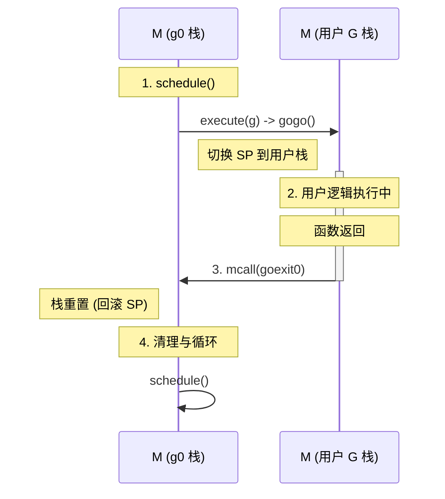
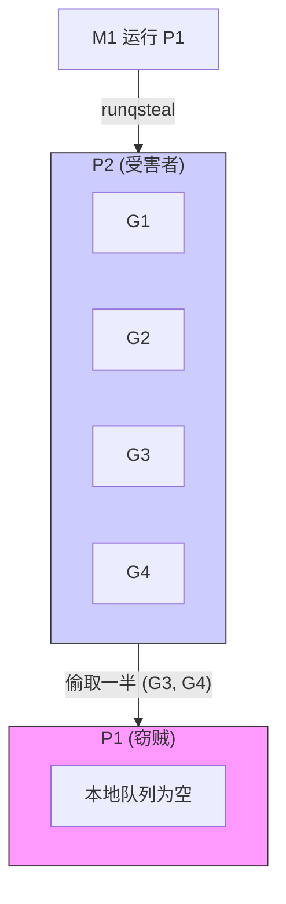

# GMP 调度器设计 - 第二章：运转的齿轮 (The Gears of Execution)

> **第一性原理**：静态的架构只是躯壳。只有当这台机器开始轰鸣，数据的血液在 M、P、G 之间流动时，真正的魔法才刚刚开始。

## 1. 三位一体的诞生 (The Birth of Trinity)

在第一章，我画出了架构图。现在，我要让这三个角色真正“活”过来。

### 1.1 分会的建立：P 的诞生 (procresize)
在城市启动之初（`schedinit`），我首先要确定“分会”的数量。
*   **定额**：根据 `GOMAXPROCS`，我一次性划拨了相应数量的地皮。
*   **初始化**：建立了 `allp` 列表。每个 P 就像一个刚开张的办事处，配好了 **本地任务栏 (Local Run Queue)** 和 **私有小金库 (mcache)**。
*   **意义**：P 是**资源的配额**。有了 P，才有资格在这个城市里调动算力。

### 1.2 正规军的集结：M 的诞生 (newm)
正规军是昂贵的，我采取“按需征召”和“模板克隆”的策略。
*   **克隆 (Clone)**：调用 `newosproc`，利用操作系统底层的魔法，复制出一个拥有独立栈空间（`g0` 栈）的线程。
*   **宣誓 (mstart)**：新兵 M 醒来后的第一件事，就是执行 `mstart`。从此，他进入了永无止境的循环，生命中只有一件事：**找 G，跑 G**。
*   **治安官装备 (g0)**：每个 M 自带一套 `g0` 装备。当他不带人下副本时，就会换上这套装备，坐在办公室里处理调度事务。

### 1.3 冒险者的委托：G 的诞生 (newproc)
当有业务需要处理时，我们就在这里签署委托书。
*   **复用 (Reuse)**：为了省钱，我先去 P 的 **休息室 (gFree)** 看看有没有退休的冒险者。如果有，把他的旧档案擦掉，填上新任务，他就复活了。
*   **新建 (Malloc)**：只有休息室空了，我才去国库申请 2KB 新物资，招募一个全新的 G。
*   **入列**：新 G 拿着委托书，先挂在他所属 P 的本地任务栏上。如果挂不下了，就只好去中央大厅排队。

---

## 2. 摆渡人的无限轮回 (The Eternal Loop)

对于 **纯计算任务 (CPU-Bound)**，整个城市就像一个精密的钟表。每个 M 都在重复着同一个动作，我称之为 **“摆渡循环”**。

### 2.1 寻人 (Schedule)
M (穿着 g0 装备) 站在路口四处张望：
1.  **特权通道 (`sched.runnext`)**：先看刚才是不是有人插队，这里的 G 优先级最高。
2.  **本地任务栏**：看看自己兜里 P 有没有活。
3.  **中央大厅**：每隔 61 次，必须去中央大厅看一眼，防止那里的 G 饿死。
4.  **偷猎 (Steal)**：如果自己空了，就去隔壁 P 家偷一半任务过来（劫富济贫）。

### 2.2 载入 (Execute)
M 找到了 G，脱下 `g0` 装备，换上“摆渡人”马甲：
*   把 G 绑在自己背上（`M.curg = G`, `G.m = M`）。
*   修改 G 的状态：`_Grunnable` -> `_Grunning`。

### 2.3 穿越 (Gogo - Assembly)
这是最危险的一步。M 执行汇编指令 `gogo`：
*   **恢复现场**：把 CPU 的寄存器（SP, PC）全部刷成 G 的数据。
*   **跳跃**：纵身一跃，跳进副本（User Code）。
*   **关键**：此时，M 的灵魂仿佛消失了，CPU 完全由 G 掌控。

### 2.4 回归 (Goexit0 - mcall)
当 G 任务完成，或者需要调度时，G 无法自己处理后事。他必须呼唤 M 的灵魂回归。
*   **魔法咒语 (`mcall`)**：G 调用 `mcall`，瞬间把 CPU 的 SP 指针 **重置** 回 `g0` 的栈底。
*   **复位**：M 重新穿上 `g0` 装备，把自己从 G 的身上解绑。
*   **清理**：把 G 扔回休息室 (`gFree`)。
*   **再出发**：M 拍拍身上的土，重新开始第一步：寻人。

> **设计哲学**：这不是递归调用，而是一个**永不栈溢出的无限尾调用循环**。

---

## 3. 治理钉子户 (Preemption)

城市里总有一些 G 是“钉子户”（死循环或长时间计算）。他们霸占着 M，不肯出来，导致其他 G 饿死。为此，我建立了 **两道防线**。

### 3.1 第一道防线：埋雷 (Cooperative)
我在每个函数的入口都埋了一颗隐形地雷。
*   **触发**：当 M 决定要驱逐这个 G 时，他会把 G 的“警戒线”（`stackguard0`）设为一个极其离谱的值。
*   **引爆**：当 G 试图调用下一个函数时，一比对警戒线，发现“栈不够了”（其实是假的）。
*   **投降**：G 以为自己出了问题，赶紧呼叫 Runtime。Runtime 笑着说：“你没病，只是该休息了。”
*   **结果**：G 被扔回中央大厅，M 重获自由。

### 3.2 第二道防线：天降正义 (Asynchronous - Sysmon)
如果 G 极其狡猾，写了个 `for { i++ }` 这种完全不调用函数的死循环，第一道防线就废了。
这时，**监察使 (Sysmon)** 会出手。
*   **巡逻**：监察使发现某个 P 已经 10ms 没有换过人了。
*   **信号 (SIGURG)**：监察使直接向那个 M 所在的线程发送操作系统信号。
*   **注入**：操作系统中断 M 的执行，强行插入一段代码（`asyncPreempt`）。
*   **驱逐**：这段代码会保存 G 的现场，然后强行把他踢下去。

**至此，计算密集型的治理体系大成。无论 G 多么刁钻，都逃不过我的掌心。**
