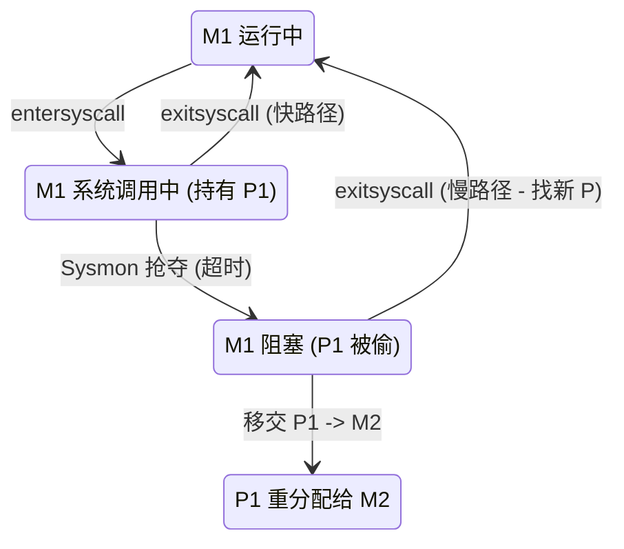
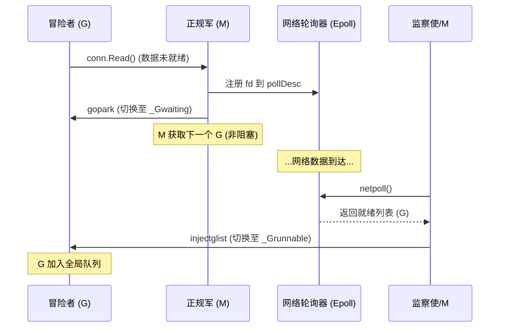

# GMP 调度器设计 - 第三章：阻塞的艺术 (The Art of Blocking)

> **第一性原理**：如果把宝贵的正规军 (M) 浪费在无尽的等待中，这座城市离破产就不远了。真正的并发，不仅是计算的并行，更是“等待”的艺术。

## 1. 瞒天过海：系统调用 (The Syscall Illusion)

当 G 需要读写文件或调用 CGO 时，M 必须亲自跳进内核的深坑。这意味着 M 会被操作系统暂停（Block），无法动弹。
**危机**：如果 M 抱着 P 一起跳进坑里，P 里的其他 G 岂不是要饿死？

### 1.1 临别赠言 (entersyscall)
M 在跳坑之前，会留一手：
*   **动作**：M 修改 P 的状态为 `_Psyscall`。
*   **潜台词**：“我要去办个手续，可能马上回来。P 先留在我名下，但如果我很久没回来，你们尽管把 P 拿走。”

### 1.2 监察使的接管 (Sysmon - Retake)
监察使 (Sysmon) 在巡逻时，发现这个 P 处于 `_Psyscall` 状态已经超过 10ms 了。
*   **判定**：M1 肯定在坑里卡住了。
*   **抢夺 (Retake)**：监察使毫不客气，把 P 从 M1 名下抢过来。
*   **过继**：监察使招手叫来一个空闲的 M2（或者新建一个），把 P 交给它：“你接着跑里面的 G。”
*   **结果**：M1 在坑里抱着空气（P 没了），而 P 里的任务继续流转，毫发无伤。

### 1.3 回归的尴尬 (exitsyscall)
M1 终于办完事从内核爬出来了。
*   **找 P**：他一摸兜，发现 P 不见了（或者状态变了）。
*   **求职**：他只能去申请一个新的 P。
    *   如果有空闲 P，皆大欢喜，继续干活。
    *   如果没 P 了（都被占用了），M1 只能无奈失业。
*   **安置**：他把手里的 G 扔到 **中央大厅 (Global Queue)**，自己则乖乖去员工宿舍睡觉（Park），等待下次被召唤。

---

## 2. 忍术：影分身 (The Netpoller)

对于网络 IO（比如几十万个 TCP 连接），我们坚决不能让 M 阻塞。
我们利用了操作系统的 **多路复用 (Epoll/Kqueue)** 技术，练就了“影分身”之术。

### 2.1 挂起 (Gopark)
当 G 发起网络请求（`conn.Read`）发现数据没来时：
*   **定身**：G 被修改状态为 `_Gwaiting`。
*   **贴条**：G 被挂在了一个特殊的 **“等待架” (pollDesc)** 上，这个架子关联着底层的 Epoll。
*   **脱身**：M 甩甩手，直接丢下这个 G，去 P 里拿下一个 G 继续跑。
*   **真相**：在 M 看来，他并没有阻塞，只是把一个 G 放进了仓库而已。

### 2.2 唤醒 (Injectglist)
谁来盯着那个“等待架”？
是 **监察使 (Sysmon)** 和 **正在找活的 M**。
*   **轮询**：他们会定期询问操作系统：“有数据到了吗？” (`netpoll`)
*   **复活**：操作系统说“fd 3 和 fd 5 有数据了”。
*   **捞人**：他们从“等待架”上把对应的 G 抠下来，改状态为 `_Grunnable`。
*   **投放**：这些复活的 G 被扔回 **中央大厅** 或 **本地队列**。
*   **结局**：G 以为自己只是睡了一觉，醒来数据就有了。

---

## 3. 全知之眼：监察使 (Sysmon)

这座城市里有一个特殊的角色，他没有 P，不需要“通行证”，他是 **System Monitor (m0)**。
他是 Runtime 的心脏，负责所有“脏活累活”。

**他的四大职责**：
1.  **抢占 (Preemption)**：专门盯着运行超过 10ms 的 G，发送信号强行驱逐。
2.  **网络 (Netpoll)**：如果所有 M 都在忙，只有他负责去 Epoll 捞人，防止网络任务饿死。
3.  **夺权 (Retake)**：从阻塞的 Syscall 中抢回 P。
4.  **保洁 (Force GC)**：如果很久没有触发 GC，他会强制开启垃圾回收。

他像一个不知疲倦的守护者，在 10ms 的睡眠和 20us 的活跃之间切换，维持着城市的秩序。

---

## 4. 弹性伸缩：自旋与唤醒 (Spinning & Wakeup)

城市里的 M 究竟要维持多少？太少会拥堵，太多会浪费。
我们采用了一种 **“且战且退”** 的弹性策略。

### 4.1 自旋 (Spinning)
当一个 M 没活干了，他不会立刻去睡觉。他会进入 **“亢奋状态” (Spinning)**。
*   **表现**：他像个无头苍蝇一样，疯狂地检查中央大厅、轮询网络、去隔壁偷任务。
*   **哲学**：虽然这空耗了 CPU，但**唤醒一个睡眠线程的成本太高了**（高延迟）。为了极致的响应速度，我们宁愿让他空转一会儿。

### 4.2 连环唤醒 (Wakeup Chain)
当一个新的 G 诞生（或网络复活）时：
1.  **首选**：如果有 M 正在自旋，那就把任务扔那儿，他马上就能看到。**不叫醒新线程**。
2.  **次选**：如果所有人都睡死了（没有自旋 M），那就必须 **踢醒 (Wakep)** 一个睡觉的 M。
3.  **接力**：这个被踢醒的 M 会立刻进入自旋状态，寻找任务。如果任务很多，他可能会再去踢醒下一个。

**至此，GMP 体系彻底闭环。**
它像一个有生命的有机体：在负载低时休眠，在负载高时裂变，在阻塞时断尾求生，在计算时火力全开。这就是 Go 高并发的秘密。
