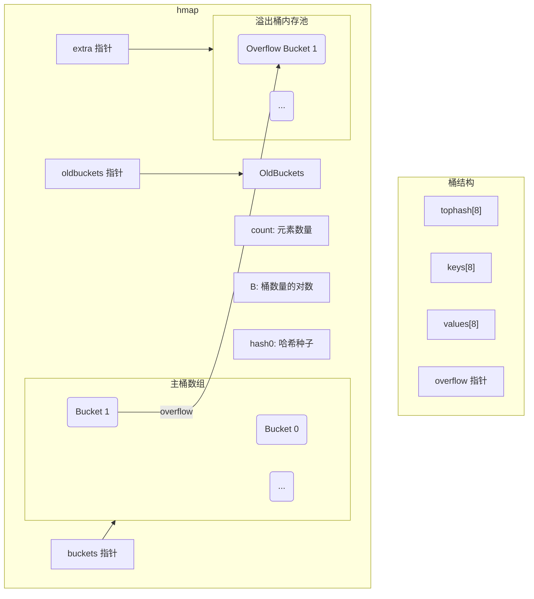
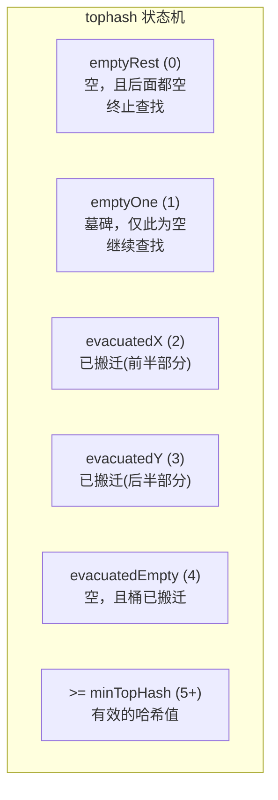
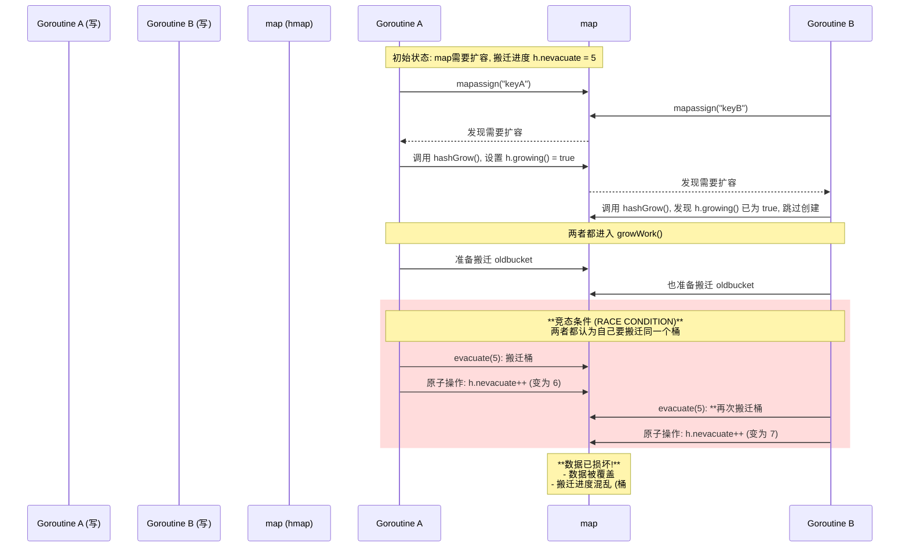
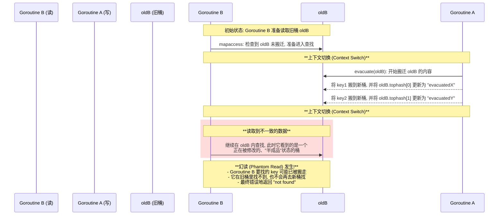

# Go Map (noswiss) 实现深度解析

这份文档，旨在从第一性原理出发，层层深入，彻底搞懂Go语言经典`map`（`noswiss`版本）的内部实现。

---

### 1. `map` 的核心使命：为什么需要哈希表？

- **根本问题**: 我们需要一种能够快速存取键值对（Key-Value）的数据结构。
- **数组的优点与局限**: 数组通过下标访问，速度极快，时间复杂度为`O(1)`。但它的`Key`必须是整数，且通常要求是连续的。
- **链表的优点与局限**: 链表可以存储任意`Key`，但查找一个元素，需要从头遍历，时间复杂度为`O(n)`，效率低下。
- **哈希表的诞生**: 为了结合两者的优点，哈希表（Hash Table）应运而生。它通过一个**哈希函数(Hash Function)**，将任意类型的`Key`，转换成一个整数“指纹”（哈希值），然后用这个哈希值，作为数组的下标，去定位数据。理想情况下，这让`map`的存取操作，都能接近`O(1)`的效率。

---

### 2. 冲突的宿命：链表法 vs. 开放寻址法

- **核心矛盾**: 哈希函数，无法保证，对不同的`Key`，一定能生成不同的哈希值。当两个不同的`Key`，经过计算后，落在了数组的同一个下标上时，就发生了**哈希冲突(Hash Collision)**。
- **通用解决方案**: 主要有两种：
    1.  **链表法 (Chaining)**: 在数组的每个槽位（在Go中称为**桶/Bucket**）上，都挂载一个链表。所有冲突的元素，都依次，添加到这个链表中。**Go的`noswiss` map，采用的就是这种方法。**
    2.  **开放寻址法 (Open Addressing)**: 当发现槽位被占用时，通过一种探测算法（线性探测 hash(key) + 1、二次探测等），去寻找数组中的下一个可用槽位。**Go的`swiss` map，采用的是这种思想的变体。**

#### `noswiss` 的基本数据结构

Go的`map`，由一个[hmap](https://github.com/golang/go/blob/release-branch.go1.24/src/runtime/map_noswiss.go#L113-L128)结构体和多个[bmap](https://github.com/golang/go/blob/release-branch.go1.24/src/runtime/map_noswiss.go#L148-L158)（桶）结构体组成。

#### [tophash](https://github.com/golang/go/blob/release-branch.go1.24/src/runtime/map_noswiss.go#L193-L200)的设计思想：缓存友好的快速路径

[tophash](https://github.com/golang/go/blob/release-branch.go1.24/src/runtime/map_noswiss.go#L193-L200)的存在，是为了，在`map`的查找、插入和删除操作中，建立一条**缓存极其友好**的“快速失败”路径。

*   **核心问题**: 一次常规的`map`查找，可能，需要，进行多次昂贵的“指针解引用”操作（从[hmap](https://github.com/golang/go/blob/release-branch.go1.24/src/runtime/map_noswiss.go#L113-L128)到[bmap](https://github.com/golang/go/blob/release-branch.go1.24/src/runtime/map_noswiss.go#L148-L158)，再到`key`和`value`所在的内存），并且，可能会，因为`key`的类型不同（比如`string`），而需要，进行相对耗时的内存比较。

*   **[tophash](https://github.com/golang/go/blob/release-branch.go1.24/src/runtime/map_noswiss.go#L193-L200)的解决方案**:
    1.  **紧凑存储**: [tophash](https://github.com/golang/go/blob/release-branch.go1.24/src/runtime/map_noswiss.go#L193-L200)数组，与[bmap](https://github.com/golang/go/blob/release-branch.go1.24/src/runtime/map_noswiss.go#L148-L158)的其他字段，一起，存放在一块连续的内存中。当[bmap](https://github.com/golang/go/blob/release-branch.go1.24/src/runtime/map_noswiss.go#L148-L158)被加载到CPU缓存时，[tophash](https://github.com/golang/go/blob/release-branch.go1.24/src/runtime/map_noswiss.go#L193-L200)数组，也极大概率，会被一同加载。
    2.  **快速预检**: 当进行查找时，`runtime`，会先，用目标`key`的[tophash](https://github.com/golang/go/blob/release-branch.go1.24/src/runtime/map_noswiss.go#L193-L200)值，去和[bmap](https://github.com/golang/go/blob/release-branch.go1.24/src/runtime/map_noswiss.go#L148-L158)的[tophash](https://github.com/golang/go/blob/release-branch.go1.24/src/runtime/map_noswiss.go#L193-L200)数组中的8个值，进行比较。
        *   这是一个极其快速的、整型数字的比较，完全，在CPU缓存中进行，没有任何指针解引用。
        *   如果，在这8个[tophash](https://github.com/golang/go/blob/release-branch.go1.24/src/runtime/map_noswiss.go#L193-L200)中，**没有一个**，能匹配上，那么，`runtime`，就可以**100%确定**，这个`key`，绝对，不在当前的[bmap](https://github.com/golang/go/blob/release-branch.go1.24/src/runtime/map_noswiss.go#L148-L158)中，从而，可以，立即，跳过后续所有昂贵的指针解引用和`key`比较操作，直接，去检查下一个溢出桶。
    3.  **指针规避**: [tophash](https://github.com/golang/go/blob/release-branch.go1.24/src/runtime/map_noswiss.go#L193-L200)的设计，本质上，是一种“用计算换访存”的思想。它，通过，增加一点点存储（8个字节）和一次快速的计算（[tophash](https://github.com/golang/go/blob/release-branch.go1.24/src/runtime/map_noswiss.go#L193-L200)比较），来**规避**掉大量潜在的、缓慢的、对主内存的访问（指针解引用和`key`比较）。

*   **总结**: [tophash](https://github.com/golang/go/blob/release-branch.go1.24/src/runtime/map_noswiss.go#L193-L200)，是`map`性能优化的点睛之笔。它，通过，在内存布局上，实现“缓存局部性”，并在算法流程上，增加“快速预检”路径，极大地，提升了`map`在查找未命中时的性能。

### 3. 动态的艺术：扩容规则

随着元素不断增加，`map`需要扩容，来保证查找效率。`noswiss` map主要有两种扩容触发条件：

1.  **负载因子 (Load Factor) 过高**
    - **条件**: `map中的元素数量 / 桶的数量 > 6.5`。
    - **行为**: 触发一次**2倍扩容**。桶的数量，会翻倍（`B++`）。这是一个常规的、为了增加容量的扩容。

2.  **溢出桶 (Overflow Buckets) 过多**
    - **你问的“什么叫过多”**: 当`map`中的溢出桶数量，约等于主桶数量时，就会被判定为“过多”。
    - **精确条件**:
        - 当`B < 16`时，`noverflow`精确计数，条件是 `noverflow >= (1 << B)`。
        - 当`B >= 16`时，`noverflow`概率性计数，当计数值也达到阈值时触发。
    - **行为**: 触发一次**同尺寸扩容 (same-size grow)**。桶的数量，**保持不变**，但Go会更换一个哈希种子，并将所有元素**重新散列(Rehash)**一遍。这相当于一次“**洗牌**”，目的是为了消除因哈希分布不佳，而导致的长溢出链，以及清理“墓碑”，优化内存。

#### 渐进式扩容 (Incremental Growing)

无论是哪种扩容，Go都不会，一次性，把所有数据，从旧桶(`oldbuckets`)搬到新桶(`buckets`)，因为这会导致，一次非常耗时的全局暂停。相反，它采用“渐进式”的策略：

- **时机**: 只在**写操作**（增、删、改）时，才触发搬迁工作。
- **双重机制**: 每次写操作，会触发**两种**搬运动作：
    1.  **机会主义搬运**: 搬运本次写操作，随机命中的那个旧桶。
    2.  **顺序保底搬运**: 按照`h.nevacuate`计数器的顺序，额外再搬运一个旧桶。
- **目的**: 这种“随机触发 + 顺序保底”的机制，确保了，即使在最坏的情况下，搬迁工作，也能稳步地、线性地，向前推进，并最终完成。

### 无收缩机制

---

### 4. `map` 的核心操作：写入 && 查找 && 删除

#### 写入与更新 ([mapassign](https://github.com/golang/go/blob/release-branch.go1.24/src/runtime/map_noswiss.go#L605-L734))

`map`的写入操作，是所有逻辑中最复杂的，因为它不仅要处理插入和更新，还肩负着触发扩容和渐进式搬迁的重任。其完整流程，是一个严谨的、分阶段的过程：

1.  **前置检查**:
    *   检查`map`是否为`nil`，如果是，则`panic`。
    *   检查`hashWriting` flag，防止并发写。

2.  **哈希计算与定位**:
    *   和[`mapaccess`](https://github.com/golang/go/blob/release-branch.go1.24/src/runtime/map_noswiss.go#L410-L474)一样，计算`key`的哈希值，并定位到主桶（`b`）。

3.  **扩容决策**:
    *   这是写入操作的第一个关键决策点。它会检查，是否需要，立即开始一次扩容：
        *   [!h.growing()](https://github.com/golang/go/blob/release-branch.go1.24/src/runtime/map_noswiss.go#L1180-L1183): 确保当前没有正在进行的扩容。
        *   [overLoadFactor()](https://github.com/golang/go/blob/release-branch.go1.24/src/runtime/map_noswiss.go#L1160-L1163)]: 负载因子是否超过6.5？
        *   [tooManyOverflowBuckets()](https://github.com/golang/go/blob/release-branch.go1.24/src/runtime/map_noswiss.go#L1165-L1178): 溢出桶是否过多？
    *   如果满足条件，则立即调用[hashGrow()](https://github.com/golang/go/blob/release-branch.go1.24/src/runtime/map_noswiss.go#L1117-L1158)开始扩容，并重新计算定位桶`b`。

4.  **寻找目标槽位 (核心循环)**:
    *   开始`bucketloop`，遍历主桶和其所有溢出桶。
    *   在这个循环中，它会**同时做两件事**：
        a.  **寻找已有Key (用于更新)**: 尝试寻找匹配的`key`。如果找到了，说明是**更新操作**。它会直接更新`value`，然后完成操作并返回。
        b.  **寻找空槽位 (用于插入)**: 如果没找到匹配的`key`，它会继续寻找第一个可用的空槽位（[tophash](https://github.com/golang/go/blob/release-branch.go1.24/src/runtime/map_noswiss.go#L193-L200)为`emptyRest`或`emptyOne`），并将其位置（桶`insertb`和槽位索引`inserti`）记录下来，备用。

5.  **渐进式搬迁**:
    *   如果在循环开始时，`map`正在扩容中（[h.growing()](https://github.com/golang/go/blob/release-branch.go1.24/src/runtime/map_noswiss.go#L1180-L1183)为`true`），那么，本次写操作，就必须“顺手”帮忙，调用[growWork()](https://github.com/golang/go/blob/release-branch.go1.24/src/runtime/map_noswiss.go#L1209-L1218)，完成一到两个桶的搬迁工作。

6.  **执行插入**:
    *   在遍历完所有桶，都没有找到匹配的`key`后，就进入了**插入新值**的阶段。
    *   **情况一 (找到空槽)**: 如果在第4步中，已经找到了一个可用的空槽位，那么，就直接，在这个位置，插入新的`key`、`value`和[tophash](https://github.com/golang/go/blob/release-branch.go1.24/src/runtime/map_noswiss.go#L193-L200)。
    *   **情况二 (未找到空槽)**: 如果遍历完了整个桶链，发现它已经满了，那么：
        a.  调用[newoverflow()](https://github.com/golang/go/blob/release-branch.go1.24/src/runtime/map_noswiss.go#L245-L271)，从预备队中，取出一个新的溢出桶。
        b.  将这个新桶，链接到当前桶链的末尾。
        c.  在新溢出桶的第一个槽位，插入新的`key`、`value`和[tophash](https://github.com/golang/go/blob/release-branch.go1.24/src/runtime/map_noswiss.go#L193-L200)。

#### 查找 (`mapaccess`)

查找一个`key`，是一个充满细节的、“先决策，后查找”的过程。

1.  **决策阶段 (处理扩容)**: 在查找循环开始前，函数会先做出一系列宏观决策：
    - `map`在扩容吗？(`h.oldbuckets != nil`)
    - 是哪种扩容？([h.sameSizeGrow()](https://github.com/golang/go/blob/release-branch.go1.24/src/runtime/map_noswiss.go#L1185-L1188))
    - 我要找的`key`，对应的旧桶，搬了没有？(`!evacuated(oldb)`)
    - **最终决策**: 本次查找，是去`oldbuckets`里找，还是去`buckets`里找？

2.  **查找阶段 (两阶段查找)**: 在确定了目标表（新表或旧表）后，开始遍历桶和溢出链：
    - **第一阶段：[tophash](https://github.com/golang/go/blob/release-branch.go1.24/src/runtime/map_noswiss.go#L193-L200)快速筛选**: [tophash](https://github.com/golang/go/blob/release-branch.go1.24/src/runtime/map_noswiss.go#L193-L200)存储了`key`哈希值的高8位。在一个桶内，可以一次性，在8个[tophash](https://github.com/golang/go/blob/release-branch.go1.24/src/runtime/map_noswiss.go#L193-L200)值中，进行快速比较，迅速排除掉绝大部分不匹配的槽位。
    - **第二阶段：完整`key`比较**: 只有在[tophash](https://github.com/golang/go/blob/release-branch.go1.24/src/runtime/map_noswiss.go#L193-L200)匹配成功后，才会进行一次完整的、开销更大的`key`比较。

#### 删除 ([mapdelete](https://github.com/golang/go/blob/release-branch.go1.24/src/runtime/map_noswiss.go#L736-L859))

删除操作，并不会，真正地，整理内存，而是采用“**墓碑 (Tombstone)**”策略。

1.  **查找**: 首先，像查找一样，定位到目标`key`所在的槽位。
2.  **标记**: 找到后，将该槽位的[tophash](https://github.com/golang/go/blob/release-branch.go1.24/src/runtime/map_noswiss.go#L193-L200)值，设置为`emptyOne` (值为1)。
3.  **清理优化**: 后面的值是 emptyRest 情况下，从这个点开始将所有前置的 emptyOne 升级成 emptyRest，因为约定 emptyRest 后绝对是空的。

- `emptyOne`这个“墓碑”，告诉后续的查找操作：“这里是空的，但请不要停，继续往后找”。
- 这些大量的“墓碑”，正是“同尺寸扩容”需要被触发，来进行“大扫除”的原因之一。

### 5. 遍历的随机性：`for range` 的“黑魔法”

Go语言规范明确指出，`map`的遍历顺序是**不确定**的。这并非偶然，而是Go团队为了代码健壮性而进行的**防御性设计**。其目的是强制开发者，不能编写任何依赖于特定遍历顺序的脆弱代码。

这种不确定性，并非简单的“无序”，而是由一套精妙的“**双重随机**”机制，在每次`for range`循环开始时，动态决定的。

当一个`for range`循环启动时，Go运行时会创建一个内部的迭代器对象（`hiter`），并在其初始化时，确定**两个**将影响整个遍历过程的随机数：

1.  **随机的桶起始位置 (`hiter.startBucket`)**: 
    - 遍历，并不会，总是从`Bucket 0`开始。
    - 运行时会随机选择一个桶，作为遍历的起点。例如，一个有8个桶的`map`，可能会从`Bucket 5`开始，按照`5 -> 6 -> 7 -> 0 -> 1 -> 2 -> 3 -> 4`的环形顺序，进行遍历。

2.  **随机的槽位起始偏移量 (`hiter.offset`)**:
    - 这是更精妙的一点。在遍历**任何一个桶内部**的8个槽位（cell）时，也**不会**总是从`cell 0`开始。
    - 迭代器在初始化时，还会额外生成一个随机的槽位偏移量（0-7之间）。
    - 假设这个偏移量是`3`，那么，在遍历**每一个桶**时，其内部槽位的检查顺序，都将是`3 -> 4 -> 5 -> 6 -> 7 -> 0 -> 1 -> 2`。

**这种“桶起点随机 + 槽内偏移随机”的双重机制，确保了连续两次`for range`循环，得到的结果序列，也几乎不可能相同。**

#### 随机性的“不完美”：一种理论上的退化

值得注意的是，这种随机性，并非密码学级别的“完美随机”。在某些极端的、稀疏的场景下，它无法生成所有可能的元素排列组合。

- **场景**: 假设一个`map`有4个桶，其中3个桶（B1, B2, B3）各有1个元素（E1, E2, E3），B0为空。
- **推演**: 由于`map`遍历的基本单位是桶，且桶之间的环形顺序是固定的（`B1`之后必然是`B2`），因此，无论遍历起点如何随机，`E2`都不可能在`E1`之前出现（除非起点在`B1`之后）。在这种情况下，`3! = 6`种全排列中，有一部分（如`E2, E1, E3`）是永远无法产生的。

- **结论**: 这并非设计缺陷。Go团队的目标，是**破坏顺序依赖性**，而不是实现一个完美的随机洗牌算法。“足够随机”已经能完美达成这个工程目标，而追求“完美随机”的巨大开销，则是不必要的。

---

### 6. 并发、性能与设计哲学

#### `map` 不是并发安全的

首先，明确结论：Go原生的`map`**不是**并发安全的。

- 它允许多个goroutine**并发地读**。
- 但它**不允许**在有读操作的同时，进行写操作；更不允许**并发地写**。

任何在没有外部同步机制（如`mutex`）保护的情况下，对同一个`map`进行并发读写或并发写的行为，都会导致不可预知的后果，最常见的就是程序直接`panic`。

#### “唯一的努力”：`hashWriting` Flag
- Go `map`为了处理并发问题，所做的**唯一**的、也是最轻量级的努力，就是在`hmap.flags`中，使用了一个比特位：`hashWriting`。

### 附录：并发冲突可视化

若没有`hashWriting` flag的保护，`map`的数据结构会在并发访问下，被轻易地破坏。下面两个场景，通过序列图，直观地展示了其灾难性的后果。

#### 场景一：并发写 (Write-Write) 冲突

**描述**: 两个Goroutine同时对一个正好需要扩容的`map`进行写操作。

**后果分析**:
*   **数据损坏**: Goroutine B的操作，覆盖了Goroutine A的搬迁结果，导致数据丢失或重复。
*   **状态错乱**: 搬迁进度计数器`h.nevacuate`被错误地增加了两次，导致中间的桶被整个跳过，永远不会被搬迁。
*   **程序崩溃**: 如果其中一个Goroutine率先完成了整个扩容，并将`oldbuckets`置为`nil`，另一个仍在工作的Goroutine就会因访问`nil`指针而`panic`。

---

#### 场景二：并发读写 (Read-Write) 冲突

**描述**: 在`map`扩容期间，一个Goroutine在读取一个正在被另一个Goroutine搬迁的桶。

**后果分析**:
*   **幻读 (Phantom Read)**: 这是最典型的后果。读操作，在一个“即将失效”的旧桶里，找不到它想要的`key`，并且，它也错过了去新桶查找的机会（因为这个决定，是在循环开始前就做出的）。最终，它得出了“`key`不存在”的错误结论，尽管这个`key`实际上，好好地，存在于`map`中。
*   **读取到垃圾数据**: 在更极端的情况下，读操作，可能会读取到一个，已经被部分修改的`key`或`value`，导致程序逻辑错误。

---
Go 的map介绍结束了---------吗？

### 6. `map` 的未来：`swiss` map 简介

Go 1.2x版本后，实验性的`swiss` map，旨在解决缓存局部性差 (Poor Cache Locality) 指针追逐 (Pointer Chasing)。

- **核心思想**: 借鉴Google的Swiss Table，它是一种基于**开放寻址法**的变体，并结合了**SIMD（单指令多数据）**优化。
- **关键优势**:
    1.  **缓存友好**: 它将元数据（类似于[tophash](https://github.com/golang/go/blob/release-branch.go1.24/src/runtime/map_noswiss.go#L193-L200)）和`key/value`数据，分开存储。在查找时，可以先，用SIMD指令，在一个16字节的元数据块中，并行地，比较16个槽位的状态，一次性，过滤掉大量不匹配的项。这极大地，提高了CPU缓存的命中率。
    2.  **消除指针跳转**: 由于采用开放寻址，它没有[overflow](https://github.com/golang/go/blob/release-branch.go1.24/src/runtime/map_noswiss.go#L207-L209)指针。数据，在物理上，是连续存储的，消除了遍历溢出链时，大量的指针跳转开销，这对CPU的预取机制，非常友好。
    3.  **更优的空间利用率**: 相比链表法，它通常，有更高的空间利用率。

`swiss` map的实现，比`noswiss`更复杂，它代表了哈希表技术，在现代硬件上，发展的最新方向。