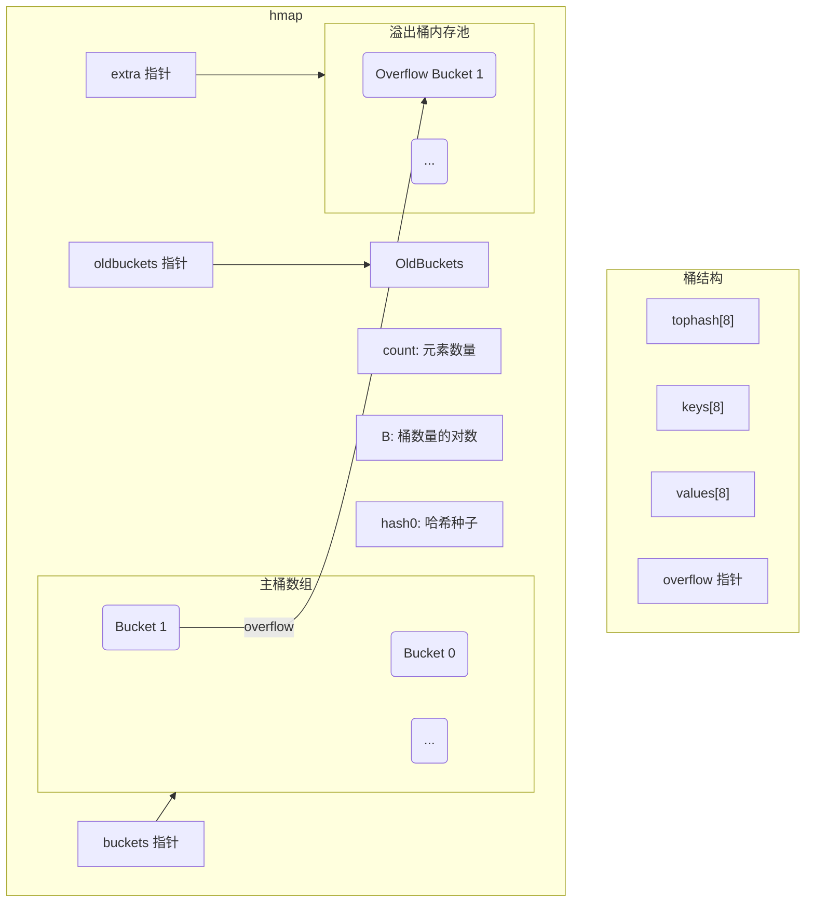
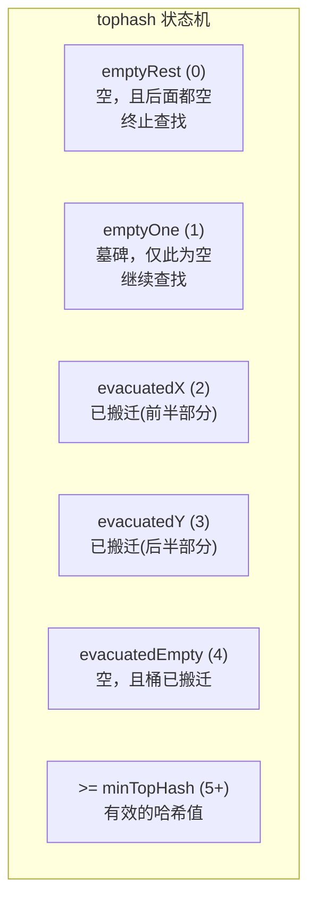
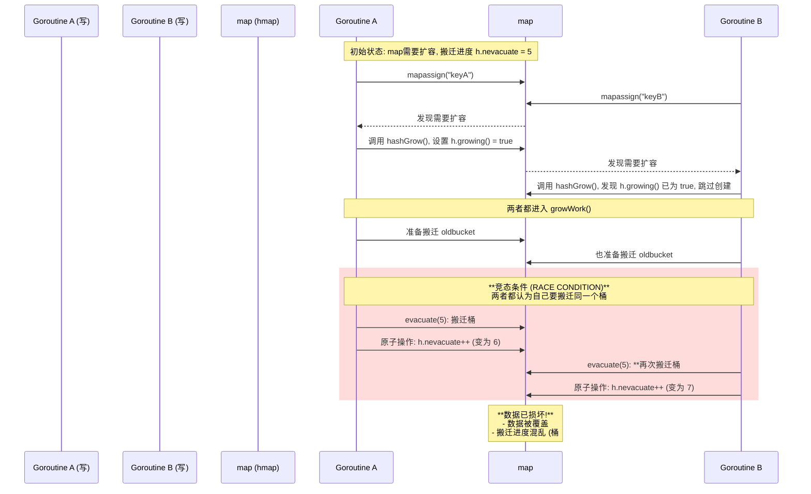
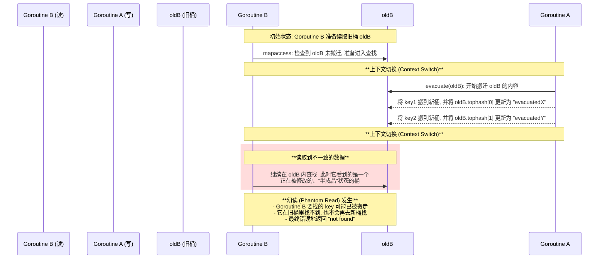

# Go Map (noswiss) 实现深度解析

这份文档，旨在从第一性原理出发，层层深入，彻底搞懂Go语言经典`map`（`noswiss`版本）的内部实现。

---

### 1. `map` 的核心使命：为什么需要哈希表？

- **根本问题**: 我们需要一种能够快速存取键值对（Key-Value）的数据结构。
- **数组的优点与局限**: 数组通过下标访问，速度极快，时间复杂度为`O(1)`。但它的`Key`必须是整数，且通常要求是连续的。
- **链表的优点与局限**: 链表可以存储任意`Key`，但查找一个元素，需要从头遍历，时间复杂度为`O(n)`，效率低下。
- **哈希表的诞生**: 为了结合两者的优点，哈希表（Hash Table）应运而生。它通过一个**哈希函数(Hash Function)**，将任意类型的`Key`，转换成一个整数“指纹”（哈希值），然后用这个哈希值，作为数组的下标，去定位数据。理想情况下，这让`map`的存取操作，都能接近`O(1)`的效率。

---

### 2. 冲突的宿命：链表法 vs. 开放寻址法

- **核心矛盾**: 哈希函数，无法保证，对不同的`Key`，一定能生成不同的哈希值。当两个不同的`Key`，经过计算后，落在了数组的同一个下标上时，就发生了**哈希冲突(Hash Collision)**。
- **通用解决方案**: 主要有两种：
    1.  **链表法 (Chaining)**: 在数组的每个槽位（在Go中称为**桶/Bucket**）上，都挂载一个链表。所有冲突的元素，都依次，添加到这个链表中。**Go的`noswiss` map，采用的就是这种方法。**
    2.  **开放寻址法 (Open Addressing)**: 当发现槽位被占用时，通过一种探测算法（线性探测 hash(key) + 1、二次探测等），去寻找数组中的下一个可用槽位。**Go的`swiss` map，采用的是这种思想的变体。**

#### `noswiss` 的基本数据结构

Go的`map`，由一个[hmap](https://github.com/golang/go/blob/release-branch.go1.24/src/runtime/map_noswiss.go#L113-L128)结构体和多个[bmap](https://github.com/golang/go/blob/release-branch.go1.24/src/runtime/map_noswiss.go#L148-L158)（桶）结构体组成。

```mermaid
graph TD
    subgraph hmap
        count[count: 元素数量]
        B[B: 桶数量的对数]
        hash0[hash0: 哈希种子]
        buckets[buckets 指针] --> MainBuckets
        oldbuckets[oldbuckets 指针] --> OldBuckets
        extra[extra 指针] --> OverflowPool
    end

    subgraph MainBuckets [主桶数组]
        B0(Bucket 0)
        B1(Bucket 1)
        B2(...)
    end

    subgraph bmap [桶结构]
        tophash["tophash[8]"]
        keys["keys[8]"]
        values["values[8]"]
        overflow["overflow 指针"]
    end

    subgraph OverflowPool [溢出桶内存池]
        O1(Overflow Bucket 1)
        O2(...)
    end

    B1 -- overflow --> O1
```
### 3. 动态的艺术：扩容规则

随着元素不断增加，`map`需要扩容，来保证查找效率。`noswiss` map主要有两种扩容触发条件：

1.  **负载因子 (Load Factor) 过高**
    - **条件**: `map中的元素数量 / 桶的数量 > 6.5`。
    - **行为**: 触发一次**2倍扩容**。桶的数量，会翻倍（`B++`）。这是一个常规的、为了增加容量的扩容。

2.  **溢出桶 (Overflow Buckets) 过多**
    - **你问的“什么叫过多”**: 当`map`中的溢出桶数量，约等于主桶数量时，就会被判定为“过多”。
    - **精确条件**:
        - 当`B < 16`时，`noverflow`精确计数，条件是 `noverflow >= (1 << B)`。
        - 当`B >= 16`时，`noverflow`概率性计数，当计数值也达到阈值时触发。
    - **行为**: 触发一次**同尺寸扩容 (same-size grow)**。桶的数量，**保持不变**，但Go会更换一个哈希种子，并将所有元素**重新散列(Rehash)**一遍。这相当于一次“**洗牌**”，目的是为了消除因哈希分布不佳，而导致的长溢出链，以及清理“墓碑”，优化内存。

#### 渐进式扩容 (Incremental Growing)

无论是哪种扩容，Go都不会，一次性，把所有数据，从旧桶(`oldbuckets`)搬到新桶(`buckets`)，因为这会导致，一次非常耗时的全局暂停。相反，它采用“渐进式”的策略：

- **时机**: 只在**写操作**（增、删、改）时，才触发搬迁工作。
- **双重机制**: 每次写操作，会触发**两种**搬运动作：
    1.  **机会主义搬运**: 搬运本次写操作，随机命中的那个旧桶。
    2.  **顺序保底搬运**: 按照`h.nevacuate`计数器的顺序，额外再搬运一个旧桶。
- **目的**: 这种“随机触发 + 顺序保底”的机制，确保了，即使在最坏的情况下，搬迁工作，也能稳步地、线性地，向前推进，并最终完成。

---

### 4. `map` 的核心操作：查找与删除

#### 查找 (`mapaccess`)

查找一个`key`，是一个充满细节的、“先决策，后查找”的过程。

1.  **决策阶段 (处理扩容)**: 在查找循环开始前，函数会先做出一系列宏观决策：
    - `map`在扩容吗？(`h.oldbuckets != nil`)
    - 是哪种扩容？([h.sameSizeGrow()](https://github.com/golang/go/blob/release-branch.go1.24/src/runtime/map_noswiss.go#L1185-L1188))
    - 我要找的`key`，对应的旧桶，搬了没有？(`!evacuated(oldb)`)
    - **最终决策**: 本次查找，是去`oldbuckets`里找，还是去`buckets`里找？

2.  **查找阶段 (两阶段查找)**: 在确定了目标表（新表或旧表）后，开始遍历桶和溢出链：
    - **第一阶段：[tophash](https://github.com/golang/go/blob/release-branch.go1.24/src/runtime/map_noswiss.go#L193-L200)快速筛选**: [tophash](https://github.com/golang/go/blob/release-branch.go1.24/src/runtime/map_noswiss.go#L193-L200)存储了`key`哈希值的高8位。在一个桶内，可以一次性，在8个[tophash](https://github.com/golang/go/blob/release-branch.go1.24/src/runtime/map_noswiss.go#L193-L200)值中，进行快速比较，迅速排除掉绝大部分不匹配的槽位。
    - **第二阶段：完整`key`比较**: 只有在[tophash](https://github.com/golang/go/blob/release-branch.go1.24/src/runtime/map_noswiss.go#L193-L200)匹配成功后，才会进行一次完整的、开销更大的`key`比较。

#### 删除 ([mapdelete](https://github.com/golang/go/blob/release-branch.go1.24/src/runtime/map_noswiss.go#L736-L859))

删除操作，并不会，真正地，整理内存，而是采用“**墓碑 (Tombstone)**”策略。

1.  **查找**: 首先，像查找一样，定位到目标`key`所在的槽位。
2.  **标记**: 找到后，将该槽位的[tophash](https://github.com/golang/go/blob/release-branch.go1.24/src/runtime/map_noswiss.go#L193-L200)值，设置为`emptyOne` (值为1)。

```mermaid
graph TD
    subgraph tophash 状态机
        E["emptyRest (0)<br>空，且后面都空<br>终止查找"]
        O["emptyOne (1)<br>墓碑，仅此为空<br>继续查找"]
        X["evacuatedX (2)<br>已搬迁(前半部分)"]
        Y["evacuatedY (3)<br>已搬迁(后半部分)"]
        EE["evacuatedEmpty (4)<br>空，且桶已搬迁"]
        V[">= minTopHash (5+)<br>有效的哈希值"]
    end
```
- `emptyOne`这个“墓碑”，告诉后续的查找操作：“这里是空的，但请不要停，继续往后找”。
- 这些大量的“墓碑”，正是“同尺寸扩容”需要被触发，来进行“大扫除”的原因之一。

### 5. 并发、性能与设计哲学

#### `map` 不是并发安全的

首先，明确结论：Go原生的`map`**不是**并发安全的。

- 它允许多个goroutine**并发地读**。
- 但它**不允许**在有读操作的同时，进行写操作；更不允许**并发地写**。

任何在没有外部同步机制（如`mutex`）保护的情况下，对同一个`map`进行并发读写或并发写的行为，都会导致不可预知的后果，最常见的就是程序直接`panic`。

#### “唯一的努力”：`hashWriting` Flag
- Go `map`为了处理并发问题，所做的**唯一**的、也是最轻量级的努力，就是在`hmap.flags`中，使用了一个比特位：`hashWriting`。

### 附录：并发冲突可视化

若没有`hashWriting` flag的保护，`map`的数据结构会在并发访问下，被轻易地破坏。下面两个场景，通过序列图，直观地展示了其灾难性的后果。

#### 场景一：并发写 (Write-Write) 冲突

**描述**: 两个Goroutine同时对一个正好需要扩容的`map`进行写操作。

```mermaid
sequenceDiagram
    participant Goroutine A (写)
    participant Goroutine B (写)
    participant map (hmap)

    Note over Goroutine A, map: 初始状态: map需要扩容, 搬迁进度 h.nevacuate = 5

    Goroutine A->>map: mapassign("keyA")
    Goroutine B->>map: mapassign("keyB")

    map-->>Goroutine A: 发现需要扩容
    Goroutine A->>map: 调用 hashGrow(), 设置 h.growing() = true

    map-->>Goroutine B: 发现需要扩容
    Goroutine B->>map: 调用 hashGrow(), 发现 h.growing() 已为 true, 跳过创建

    Note over Goroutine A, Goroutine B: 两者都进入 growWork()
    Goroutine A->>map: 准备搬迁 oldbucket #5
    Goroutine B->>map: 也准备搬迁 oldbucket #5

    rect rgb(255, 220, 220)
        Note over Goroutine A, Goroutine B: **竞态条件 (RACE CONDITION)**<br/>两者都认为自己要搬迁同一个桶
        Goroutine A->>map: evacuate(5): 搬迁桶 #5
        Goroutine A->>map: 原子操作: h.nevacuate++ (变为 6)
        Goroutine B->>map: evacuate(5): **再次搬迁桶 #5, 覆盖A的结果!**
        Goroutine B->>map: 原子操作: h.nevacuate++ (变为 7)
    end

    Note over map: **数据已损坏!**<br/>- 数据被覆盖<br/>- 搬迁进度混乱 (桶 #6 被跳过)
```

**后果分析**:
*   **数据损坏**: Goroutine B的操作，覆盖了Goroutine A的搬迁结果，导致数据丢失或重复。
*   **状态错乱**: 搬迁进度计数器`h.nevacuate`被错误地增加了两次，导致中间的桶被整个跳过，永远不会被搬迁。
*   **程序崩溃**: 如果其中一个Goroutine率先完成了整个扩容，并将`oldbuckets`置为`nil`，另一个仍在工作的Goroutine就会因访问`nil`指针而`panic`。

---

#### 场景二：并发读写 (Read-Write) 冲突

**描述**: 在`map`扩容期间，一个Goroutine在读取一个正在被另一个Goroutine搬迁的桶。

```mermaid
sequenceDiagram
    participant Goroutine B (读)
    participant Goroutine A (写)
    participant oldB (旧桶)

    Note over Goroutine B, oldB: 初始状态: Goroutine B 准备读取旧桶 oldB

    Goroutine B->>oldB: mapaccess: 检查到 oldB 未搬迁, 准备进入查找
    
    Note over Goroutine B, Goroutine A: **上下文切换 (Context Switch)**

    Goroutine A->>oldB: evacuate(oldB): 开始搬迁 oldB 的内容
    Goroutine A-->>oldB: 将 key1 搬到新桶, 并将 oldB.tophash[0] 更新为 "evacuatedX"
    Goroutine A-->>oldB: 将 key2 搬到新桶, 并将 oldB.tophash[1] 更新为 "evacuatedY"
    
    Note over Goroutine B, Goroutine A: **上下文切换 (Context Switch)**

    rect rgb(255, 220, 220)
        Note over Goroutine B, oldB: **读取到不一致的数据**
        Goroutine B->>oldB: 继续在 oldB 内查找, 此时它看到的是一个<br/>正在被修改的、"半成品"状态的桶
    end
    
    Note over Goroutine B, oldB: **幻读 (Phantom Read) 发生!**<br/>- Goroutine B 要找的 key 可能已被搬走<br/>- 它在旧桶里找不到, 也不会再去新桶找<br/>- 最终错误地返回 "not found"
```

**后果分析**:
*   **幻读 (Phantom Read)**: 这是最典型的后果。读操作，在一个“即将失效”的旧桶里，找不到它想要的`key`，并且，它也错过了去新桶查找的机会（因为这个决定，是在循环开始前就做出的）。最终，它得出了“`key`不存在”的错误结论，尽管这个`key`实际上，好好地，存在于`map`中。
*   **读取到垃圾数据**: 在更极端的情况下，读操作，可能会读取到一个，已经被部分修改的`key`或`value`，导致程序逻辑错误。

---
Go 的map介绍结束了---------吗？

### 6. `map` 的未来：`swiss` map 简介

Go 1.2x版本后，实验性的`swiss` map，旨在解决缓存局部性差 (Poor Cache Locality) 指针追逐 (Pointer Chasing)。

- **核心思想**: 借鉴Google的Swiss Table，它是一种基于**开放寻址法**的变体，并结合了**SIMD（单指令多数据）**优化。
- **关键优势**:
    1.  **缓存友好**: 它将元数据（类似于[tophash](https://github.com/golang/go/blob/release-branch.go1.24/src/runtime/map_noswiss.go#L193-L200)）和`key/value`数据，分开存储。在查找时，可以先，用SIMD指令，在一个16字节的元数据块中，并行地，比较16个槽位的状态，一次性，过滤掉大量不匹配的项。这极大地，提高了CPU缓存的命中率。
    2.  **消除指针跳转**: 由于采用开放寻址，它没有[overflow](https://github.com/golang/go/blob/release-branch.go1.24/src/runtime/map_noswiss.go#L207-L209)指针。数据，在物理上，是连续存储的，消除了遍历溢出链时，大量的指针跳转开销，这对CPU的预取机制，非常友好。
    3.  **更优的空间利用率**: 相比链表法，它通常，有更高的空间利用率。

`swiss` map的实现，比`noswiss`更复杂，它代表了哈希表技术，在现代硬件上，发展的最新方向。