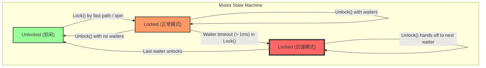

# 从零到队列锁：设计Mutex

本文档记录了从最基本原理开始，一步步设计一个互斥锁（Mutex）的过程。每个版本都解决了前一个版本遇到的问题，从而揭示了最终复杂设计背后的权衡与思考。

---

### v0.1: 朴素的自旋锁 (The Naive Spinlock)

**目标**: 实现最基本的互斥：一次只允许一个Goroutine进入临界区。

**设计**: 我们只需要一个整数（`state`）作为我们的锁，其中`0`代表解锁，`1`代表锁定。我们使用原子的`CompareAndSwap` (CAS) 操作在一个循环中尝试获取锁。

**代码**:

```go
// MutexV1 是一个朴素的自旋锁实现。
type MutexV1 struct {
	state int32
}

// Lock 通过忙等待获取锁。
func (m *MutexV1) Lock() {
	for !atomic.CompareAndSwapInt32(&m.state, 0, 1) {
		// 提示CPU我们正处于一个自旋等待循环中。
		// 这是一种最简单的自旋形式。
		// 出让处理器，让其他goroutine有机会运行。
		runtime.Gosched() 
	}
}

// Unlock 释放锁。
func (m *MutexV1) Unlock() {
	atomic.StoreInt32(&m.state, 0)
}
```

**遇到的问题**: 这个实现在高竞争下会导致极端的CPU消耗。`for`循环是一个“忙等待”循环，它在等待锁被释放时持续地燃烧CPU周期。这是非常低效的，并且会饿死其他需要CPU来做实际工作的Goroutine。

---

### v0.2: 队列锁 (引入信号量)

**目标**: 解决CPU空转问题。获取不到锁的Goroutine应该去“睡觉”，而不是消耗CPU。

**设计**: 我们引入第二个组件：信号量（Semaphore）。信号量是操作系统或运行时提供的一种底层同步原语，可以用来管理一个休眠的Goroutine队列并唤醒它们。

- **状态**: 我们仍然使用`state`整数作为锁本身。
- **信号量**: 我们增加一个信号量（`sema`）来管理等待者。

**概念代码**:

*注意: 我们无法在用户空间的Go代码中真正实现这一点，因为信号量操作（`runtime_SemacquireMutex`, `runtime_Semrelease`）是Go运行时的内部函数。以下代码是一个概念性的表示。*

```go
// MutexV2 是一个概念性的队列锁。
type MutexV2 struct {
	state int32
	sema  uint32 // 代表用于等待goroutine的信号量
}

// Lock 获取锁，或者让goroutine进入睡眠。
func (m *MutexV2) Lock() {
	// 快速路径：直接尝试获取锁。
	if atomic.CompareAndSwapInt32(&m.state, 0, 1) {
		return // 成功！
	}

	// 慢速路径：获取失败，需要等待。
	// 在真实的Mutex实现中，这里会进入一个循环来处理复杂状态。
	// 为简化概念，我们直接描述流程：

	// 1. 我们会原子性地增加一个等待者计数（在真实的Mutex中，这是state的一部分）。

	// 2. 然后，我们调用运行时，让我们在信号量上进入睡眠。
	// runtime_SemacquireMutex(&m.sema, ...)
}

// Unlock 释放锁并唤醒一个等待的goroutine。
func (m *MutexV2) Unlock() {
	// 快速路径：原子性地减少状态值。如果结果为0，说明没有等待者。
	// 真实的实现更复杂，但我们简化概念：
	atomic.StoreInt32(&m.state, 0)

	// 释放锁后，我们检查是否有等待者。
	// 如果有，就唤醒一个。
	// runtime_Semrelease(&m.sema, ...)
}
```

**遇到的新问题**: 这个设计是**正确**的，但**不一定高效**。让一个Goroutine睡眠和唤醒（上下文切换）的成本相对较高（微秒级）。如果一个锁被持有的时间非常短（纳秒级），那么去睡一觉再醒来的成本，远比原地自旋片刻的成本要高得多。这就引出了下一个优化方向：**自适应自旋 (Adaptive Spinning)**。

---

### v1.0: 自适应自旋锁 (The Adaptive Spinning Lock)

**目标**: 优化“锁持有时间极短”场景下的性能，避免因不必要的上下文切换而导致的性能损耗。

**设计**: 我们在让Goroutine进入睡眠之前，增加一个“赌一把”的环节。我们让它在原地“自旋”一小会儿，期望锁能在这段极短的时间内被释放。这种自旋必须是“自适应”的，即需要满足一定条件才能触发，而不是盲目自旋。

**自旋的先决条件 (When to Spin?)**:
1.  **多核CPU**: 在单核CPU上，自旋毫无意义。因为如果当前Goroutine不放弃CPU，那个持有锁的Goroutine就永远没有机会运行和释放锁。所以，必须在多核CPU上才能自旋。
2.  **调度器状态**: Go调度器中可运行的Goroutine队列不能是空的。如果队列是空的，说明系统很空闲，当前Goroutine最好是出让CPU，让其他可能持有锁的Goroutine运行。
3.  **自旋次数限制**: 不能无限自旋，必须有一个上限（例如，`active_spin` 次），超过这个次数就必须放弃自旋，进入睡眠，以防止在锁持有时间较长时浪费CPU。

*这些条件在真实的Go运行时中，由 `runtime_canSpin` 函数来判断。*

**概念代码**:

```go
// MutexV3 是一个带有自适应自旋的概念锁。

const active_spin = 4 // 自旋次数

func (m *MutexV3) Lock() {
	// 快速路径：尝试直接获取锁。
	if atomic.CompareAndSwapInt32(&m.state, 0, 1) {
		return
	}

	// 慢速路径：进入一个循环，尝试自旋或睡眠。
	for {
		// 检查锁是否已被释放，并且没有其他等待者（这是对真实Mutex的简化）。
		// 如果锁看起来是可用的...
		if m.state == 0 && atomic.CompareAndSwapInt32(&m.state, 0, 1) {
			return
		}

		// 判断是否可以自旋 (runtime_canSpin())
		if runtime_canSpin() {
			// 执行几次PAUSE指令，消耗一点时间，然后继续下一次循环尝试抢锁。
			// for i := 0; i < active_spin_cnt; i++ { runtime_doSpin() }
			// 在概念代码中，我们用一次循环代表一次自旋尝试。
			continue
		}

		// 如果不能自旋，或者自旋多次失败，就准备去睡觉。
		// 1. 原子性地增加等待者计数。
		// 2. 调用运行时信号量使其睡眠。
		// runtime_SemacquireMutex(&m.sema, ...)
		// 醒来后，继续for循环的下一次迭代。
	}
}

// Unlock的逻辑基本不变。
func (m *MutexV3) Unlock() {
	atomic.StoreInt32(&m.state, 0)
	// 如果有等待者，唤醒一个。
	// runtime_Semrelease(&m.sema, ...)
}
```

**遇到的新问题**: 性能提升了，但也引入了严重的**不公平性 (Unfairness)**。一个刚来的、正在CPU上自旋的Goroutine（G-Spinner），和一个已经在等待队列里睡了很久、刚刚被唤醒的Goroutine（G-Waiter），会同时去竞争锁。由于G-Spinner正在CPU上活跃运行，它有巨大的时间优势，极有可能会“抢走”本该属于G-Waiter的锁。如果运气不好，G-Waiter可能会被反复地唤醒、抢锁失败、再睡眠，从而被“饿死” (Starvation)。这就引出了下一个关键设计：**饥饿模式 (Starvation Mode)**。

---

### v2.0: 公平的饥饿模式 (The Fair Starvation Mode)

**目标**: 解决v1.0中自旋导致的严重不公平问题，确保没有Goroutine会被“饿死”。

**设计**: 我们引入一个全新的操作模式——**饥饿模式**。当系统检测到可能有Goroutine等待时间过长时，整个锁的行为规则都会改变，从“性能优先”切换到“公平优先”。

#### 1. 如何进入饥饿模式？ -> 等待超时

- **触发条件**: 任何一个Goroutine，在它尝试获取锁（`Lock`）的过程中，如果发现自己**累计的等待时间超过了一个固定的阈值**（在Go中是1毫秒），它就有责任将锁切换到饥饿模式。
- **实现**: `Lock`的慢速路径循环中，需要记录一个`waitStartTime`。每次循环时，都检查`currentTime - waitStartTime`是否大于阈值。如果是，就触发模式切换。

#### 2. 饥饿模式下的新规则 -> 公平优先

一旦锁进入饥饿模式，以下规则生效：

- **禁止自旋**: 新来的Goroutine，即使满足自旋的物理条件，也不允许自旋。它们必须立即放弃竞争，去等待队列的末尾排队。
- **所有权直接交接**: 当锁被释放时（`Unlock`），它**不会**简单地变为“可用”状态让大家去抢。而是会**直接唤醒**等待队列的队首Goroutine，并将锁的所有权**直接移交**给它。这保证了严格的先进先出（FIFO）顺序。

#### 3. 如何表示饥饿状态？ -> 挤占`state`状态位

为了最高效地管理状态，我们不能增加新的字段。我们选择从`state`这个`int32`整数中，再“挤占”出一个比特位来专门表示饥饿模式。这使得我们可以在一次原子操作中，同时管理多个状态。

- `mutexLocked` (第0位): `0`表示解锁, `1`表示锁定。
- `mutexStarving` (第2位): `0`表示正常模式, `1`表示饥饿模式。
- `waiter count` (高29位): 等待者的数量。

*（真实的Go Mutex还用了第1位做`mutexWoken`，但我们在这里简化设计）*

通过位运算（`|`, `&`, `^`），我们可以在一次原子的CAS操作中，同时读取和修改这多个状态。

#### 4. 如何退出饥饿模式？ -> 最后一个等待者负责

- **触发条件**: 当一个被唤醒的Goroutine获得锁时，它会检查自己是不是等待队列中的**最后一个**。
- **执行者**: 如果它是最后一个等待者，那么它在获得锁的同时，就有责任将`mutexStarving`标志位清除，让锁**恢复到正常的、性能优先的模式**。
- **为什么？** 因为当等待队列为空时，“公平”问题已经不复存在了。此时应该将锁还给性能更高的正常模式，让新来的Goroutine有机会通过自旋快速获取锁。

**最终形态（概念）**: 我们的`Mutex`现在拥有了两套工作模式，并能在“性能”和“公平”之间根据实时的竞争情况，进行动态、自适应的切换。这已经非常接近Go标准库`sync.Mutex`的最终设计了。

---

### v2.1: 精益求精的Woken信标 (The Polished Woken Signal)

**目标**: 进一步优化**正常模式**下的性能，避免“无效唤醒”所带来的性能损耗。

**遇到的新问题**: 饥饿模式完美地解决了公平性问题。但在竞争激烈的**正常模式**下，一个性能问题依然存在：当一个解锁者（Unlocker）唤醒了一个沉睡者（Waiter）后，锁完全有可能在Waiter被调度运行之前，就被一个新来的、正在CPU上活跃的自旋者（Spinner）抢走。这次唤醒就成了一次“无效唤醒”，白白浪费了一次昂贵的上下文切换。

**设计**: 我们引入最后一个状态位 `mutexWoken`，作为解锁者、自旋者和被唤醒者之间的一个**协调信标**或“君子协定”，以避免无效唤醒。

#### `mutexWoken` (第1位) 的新规则:

这个信标就像在锁的门口挂上了一个“**预留**”的牌子，它的核心是协调，而不是强制。

1.  **解锁者 (Unlocker) 的职责**:
    *   在正常模式下，当Unlocker发现有等待者并准备唤醒一个时，它**不会**立即去唤醒。
    *   它会先尝试通过CAS，将等待者计数减一，并**同时设置`mutexWoken`位**。这相当于它在说：“我已经‘内定’了一个继承人，正在路上了，门口挂上‘预留’牌子。”
    *   设置成功后，它才去真正唤醒那个Waiter。
    *   **例外**: 如果Unlocker在尝试设置`mutexWoken`时，发现已经有别的Spinner提前设置了`mutexWoken`位，那么Unlocker就会“心领神会”，知道外面有更“饥渴”的自旋者，于是它就**放弃本次唤醒**，直接返回，把锁留给自旋者去抢。

2.  **自旋者 (Spinner) 的职责**:
    *   在自旋期间，Spinner会尝试通过CAS**设置`mutexWoken`位**。这相当于它在举手示意：“我醒着！别去叫睡着的了，把机会留给我！”
    *   在尝试抢锁（CAS `mutexLocked`位）之前，它会检查`mutexWoken`位。如果发现牌子已经被Unlocker挂上了（为某个Waiter预留了），它就会知趣地**放弃本次抢锁**，继续自旋等待下一个机会。

3.  **被唤醒者 (Waiter) 的职责**:
    *   当Waiter被唤醒并成功获取锁之后，它有责任**清除`mutexWoken`位**，相当于把门口的“预留”牌子摘下来，让锁的状态回归正常。

**最终设计**: 通过引入`mutexWoken`信标，我们的`Mutex`在正常模式下的协作变得更加“智能”。它最大程度地将在CPU上活跃的Goroutine（自旋者）利用起来，避免了不必要的、昂贵的上下文切换，将性能压榨到了极致。至此，我们已经完整地、从第一性原理出发，推导出了一个与`sync.Mutex`在设计思想上完全一致的、高性能、自适应、且公平的现代互斥锁。

---

### 总结：Mutex 状态转换图

为了将整个`Mutex`的动态行为可视化，以下的状态转换图总结了其核心逻辑。它清晰地展示了锁如何在不同的模式之间切换，以及触发这些切换的关键事件。



这张图直观地体现了`Mutex`设计的核心权衡：
- **正常路径**: 在 `Unlocked` 和 `Locked (Normal)` 之间快速循环，追求最高性能。
- **饥饿路径**: 当检测到不公平（等待超时）时，进入 `Locked (Starving)` 状态，通过严格的FIFO来保证公平，直到等待队列被清空，才回归到高性能的正常模式。

