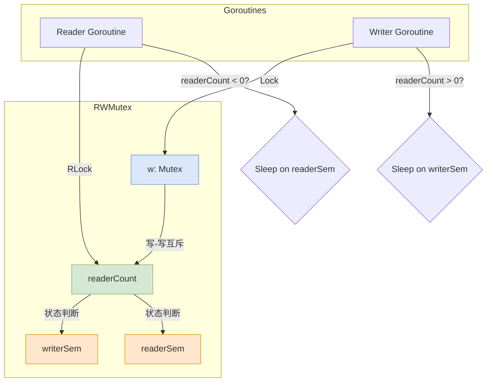

# `sync.RWMutex` 设计推演：从互斥到读写分离

本文档旨在从第一性原理出发，通过“堆积木”的方式，一步步推导出 Go 语言 `sync.RWMutex` 的核心设计。我们将从一个最基本的互斥锁开始，根据不断出现的新需求，逐步引入新的组件，最终构建出完整的读写锁模型。

---

## 第一部分：设计之路

### 积木一：起点 - 互斥锁 (`Mutex`)

我们手中最原始的工具，是一个互斥锁。它可以完美地解决“写-写”冲突，保证任何时刻只有一个 Goroutine 能进行写操作。

```go
// 概念代码
type NaiveRWMap struct {
    mu    sync.Mutex
    items map[string]string
}

func (m *NaiveRWMap) Write(key, value string) {
    m.mu.Lock()
    defer m.mu.Unlock()
    m.items[key] = value
}

func (m *NaiveRWMap) Read(key string) string {
    m.mu.Lock()
    defer m.mu.Unlock()
    return m.items[key]
}
```

**核心矛盾**: 这种实现，读操作和写操作会相互阻塞，读操作之间也会相互阻塞。在一个“读多写少”的场景下，这会造成巨大的性能瓶颈。我们的核心诉求是：**允许多个读操作并发执行**。

### 积木二：引入并发读，以及新的矛盾

为了实现并发读，我们不能再让 `Read` 操作去获取那个全局的互斥锁。但如果不加锁，`Read` 和 `Write` 之间就会发生数据竞争。

我们需要一种机制，来满足两个新条件：
1.  **读-读不互斥**: 多个 `Read` 操作可以同时进行。
2.  **读-写互斥**: 当有 `Read` 操作正在进行时，`Write` 操作必须等待。反之亦然。

这就需要一个能**传递状态**的组件。写操作需要一种方法来“宣告”自己的存在，并等待所有读者完成；读操作也需要一种方法来“宣告”自己的存在，并阻止写者进入。

### 积木三：核心状态变量 `readerCount`

为了解决这个状态传递问题，我们引入一个核心的整数变量 `readerCount`。我们将赋予它的不同状态值特殊的含义：

-   `readerCount == 0`: **空闲状态**。没有读者，也没有写者。
-   `readerCount > 0`: **读模式**。`readerCount` 的值，就代表当前正在并发读取的 Goroutine 的数量。
-   `readerCount < 0`: **写模式**。代表有一个写者正在持有锁，或者正在等待获取锁。

通过对这个整数进行原子操作，我们就可以在不同 Goroutine 之间，建立一个高效、无锁的状态同步机制。

**工程考量**:
为了防止写者被源源不断的读者“饿死”，我们必须规定：**一旦一个写操作到来，并宣告了它的意图，后续的所有新读操作，都必须进行等待。**

`readerCount` 的负值状态，完美地解决了这个问题。当一个写者到来时，它会原子性地将 `readerCount` 变成一个负数。后续所有新来的 `RLock` 操作，只要看到 `readerCount < 0`，就知道有写者正在等待或持有锁，它们就必须自觉地去排队，而不是直接开始读取。

**新问题**: 我们现在有了状态，但还没有行为。当一个 Goroutine 发现条件不满足时（例如，一个写者发现 `readerCount > 0`），它应该做什么？它不能在原地空转（自旋），这会浪费 CPU。它需要一种方法，让自己“睡眠”，并等待别人在未来某个时刻把它“唤醒”。

### 积木四：睡眠与唤醒机制 - 信号量

为了解决这个问题，我们引入了 Go runtime 提供的底层同步原语：**信号量 (Semaphore)**。信号量就像一个计数器，你可以尝试减少它（`acquire`），如果计数器为 0，你就会被挂起；你也可以增加它（`release`），这会唤醒一个正在等待的 Goroutine。

我们将需要两个信号量和一个内部互斥锁：

-   **`w` (`sync.Mutex`)**: 一个内部的互斥锁，专门用于解决**“写-写”冲突**。它保证了任何时刻，只有一个写者可以进入修改 `readerCount` 的临界区。

-   **`writerSem` (信号量)**: **写者的休息室**。当一个写者发现有读者正在读 (`readerCount > 0`) 时，它会在这里 `acquire` 信号量，并进入睡眠。

-   **`readerSem` (信号量)**: **读者的休息室**。当一个读者发现有写者正在等待或持有锁 (`readerCount < 0`) 时，它会在这里 `acquire` 信号量，并进入睡眠。

至此，我们已经集齐了构建 `RWMutex` 的所有核心组件。

### 积木五：等待的艺术 - `readerWait` 计数器

我们已经有了让 Goroutine 睡眠和唤醒的机制，但还有一个至关重要的细节：一个正在等待的写者，如何知道在它之前的所有读者都已经完成了？

**核心矛盾**: 当一个写者 `A` 调用 `Lock` 时，可能有 `r` 个读者正在并发地读取。写者 `A` 必须等待这 `r` 个读者全部完成，才能安全地持有写锁。它如何精确地知道，这 `r` 个人是不是都走了？

答案就是引入一个专门的计数器来追踪这个状态，这就是 `readerWait`。

-   **`readerWait` 的角色**: **一个“读者债务”计数器**。
    1.  **债务产生 (in `Lock`)**: 当写者 `A` 宣告“我要写”（将 `readerCount` 变负）时，它会得到当时正在读取的读者数量 `r`。然后，它执行 `readerWait.Add(r)`，将这份“债务”记录在案。之后，它就在 `writerSem` 上睡眠，等待债务还清。
    2.  **债务偿还 (in `RUnlock`)**: 那 `r` 个读者，在各自完成工作后，会调用 `RUnlock`。在 `RUnlock` 内部，它们会原子性地给 `readerWait` **减 1**。
    3.  **债务结清 (by the last reader)**: 当**最后一个**读者将 `readerWait` 减为 0 时，它就成了那个“关灯人”。它知道所有债务都已还清，因此，它有责任去唤醒在 `writerSem` 上等待的写者 `A`。

---

## 第二部分：完整模型与 API 实现

### 2.1 最终架构图

我们将所有积木组合在一起，得到了 `RWMutex` 的最终逻辑结构：

```go
// 概念代码
type RWMutex struct {
    w           sync.Mutex   // 写者互斥锁
    writerSem   uint32       // 写者信号量
    readerSem   uint32       // 读者信号量
    readerCount int32        // 读者计数 & 写者状态
    readerWait  int32        // 等待的写者唤醒后，需要等待的读者数
}
```



### 2.2 API 实现推演

基于这个模型，我们可以清晰地推导出四个核心 API 的逻辑：

#### `RLock()` (获取读锁)
1.  原子性地给 `readerCount` 加 1。
2.  **检查 `readerCount`**: 
    -   如果结果 **`>= 0`** (处于读模式，或从空闲变为读模式)，说明没有写者，获取读锁成功，直接返回。
    -   如果结果 **`< 0`** (处于写模式)，说明有写者正在持有或等待锁，获取读锁失败。此时，Goroutine 必须在 `readerSem` 上睡眠，等待被唤醒。

#### `RUnlock()` (释放读锁)
1.  原子性地给 `readerCount` 减 1。
2.  **检查 `readerCount`**:
    -   如果结果 **`>= 0`**，说明没有写者在等待，直接返回。
    -   如果结果 **`< 0`**，说明有写者在等待。此时，它必须去“偿还债务”：原子性地给 `readerWait` 减 1。
    -   如果 `readerWait` 减到 0，说明自己是最后一个需要被等待的读者。此时，它有责任去唤醒在 `writerSem` 上睡眠的写者。

#### `Lock()` (获取写锁)
1.  获取内部互斥锁 `w`，保证只有一个写者能继续。
2.  原子性地给 `readerCount` 减去一个巨大常数 (`rwmutexMaxReaders`)，并记录下操作前的读者数量 `r`。
3.  **检查 `r`**: 
    -   如果 `r != 0` （r 不可能小于0，判断0值是性能指令集优化），说明在它宣告“我要写”之前，有 `r` 个读者正在工作。它必须等待它们全部完成。
    -   它原子性地给 `readerWait` 加上 `r`，将这份“读者债务”记录在案。
    -   然后在 `writerSem` 上睡眠，等待被最后一个读者唤醒。
    -   如果 `r == 0`，说明没有读者，获取写锁成功，直接返回。

#### `Unlock()` (释放写锁)
1.  原子性地给 `readerCount` 加回巨大常数 (`rwmutexMaxReaders`)，将其恢复为**正数或零**，退出“写模式”。
2.  **检查 `readerCount`**:
    -   此时 `readerCount` 的值，就代表在写锁期间，有多少个读者被阻塞了。
    -   它会**一次性地、广播式地**，唤醒所有在 `readerSem` 上睡眠的读者。
3.  释放内部互斥锁 `w`，让下一个可能在等待的写者有机会竞争。
