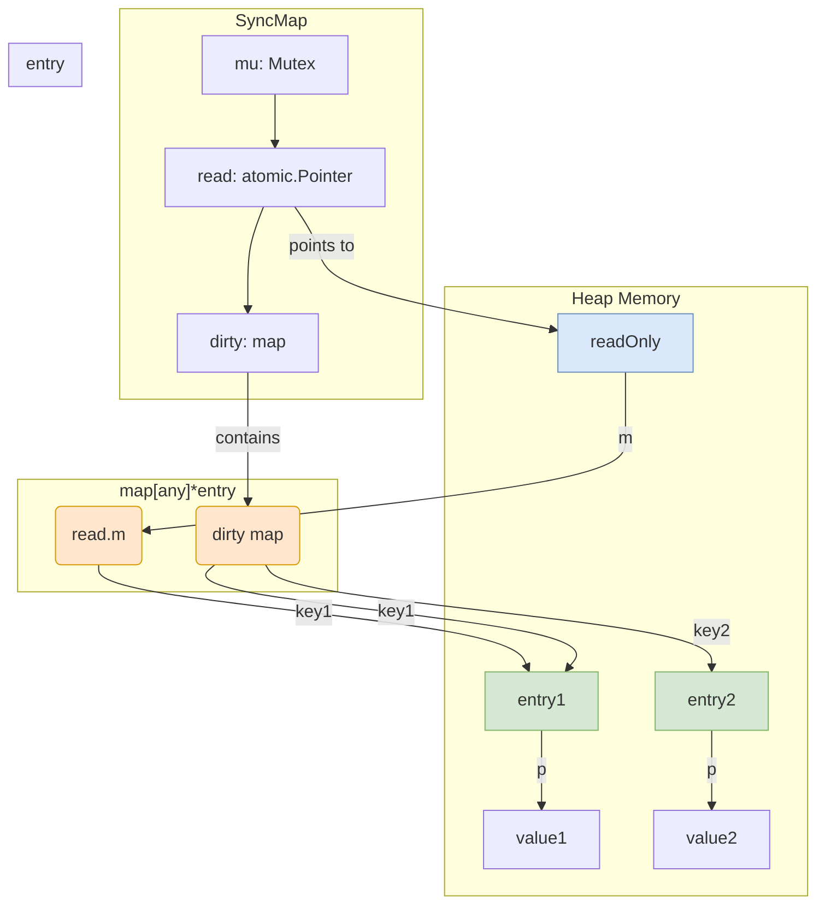
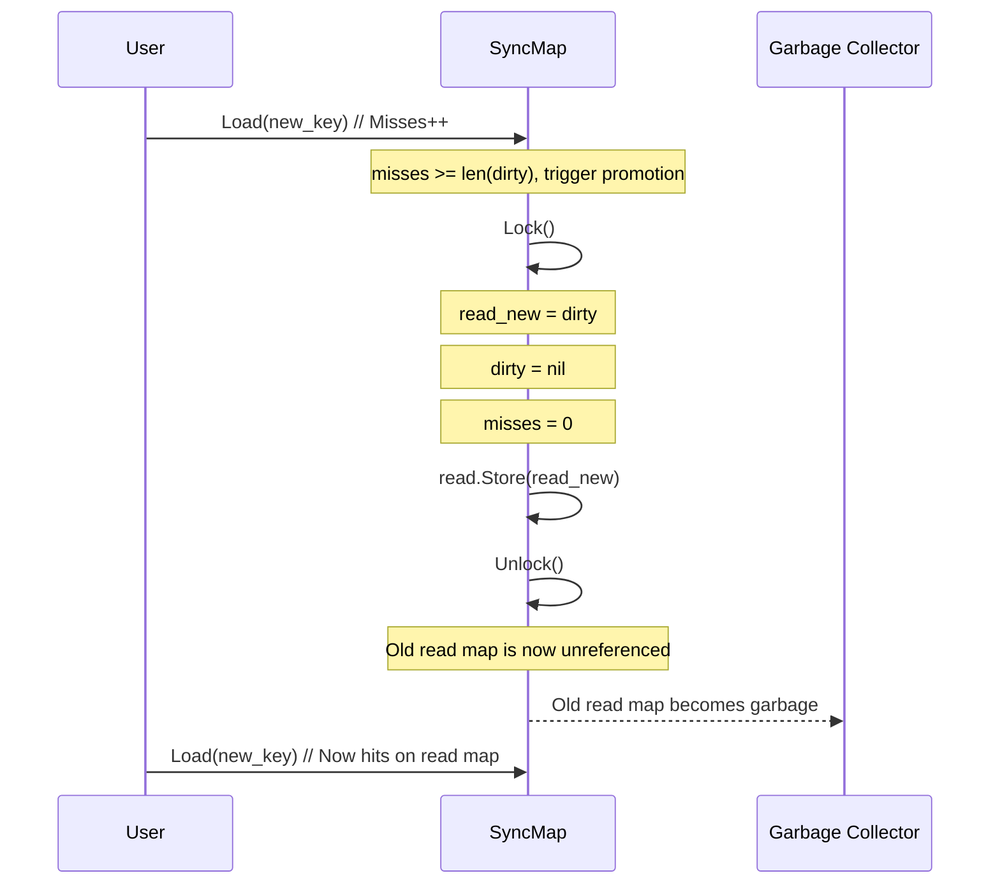
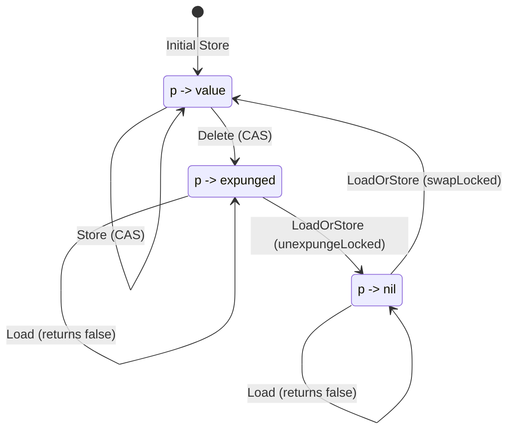

# sync.Map v1 设计原理：第一性原理推演

本文档旨在从第一性原理出发，通过“堆积木”的方式，逐步推导出 Go `sync.Map` v1 的核心设计。我们将从最基本的需求开始，每一步都为了解决前一步引入的新问题，最终自然地构建出整个系统的设计蓝图。

## 第一部分：核心需求与初始设计 (The Naive Approach ) too simple?

### 1.1 需求：一个并发安全的 `map`

在并发编程中，最常见的需求之一就是一个可以在多个 Goroutine 之间安全共享的键值存储。Go 原生的 `map` 类型并非并发安全，在多个 Goroutine 同时读写时会直接导致程序崩溃 (panic)。

### 1.2 方案一：`map + sync.Mutex`

最直观的解决方案就是用一个互斥锁 (`sync.Mutex`) 来保护一个原生 `map`。
即使是读写锁同样在操作写的时候也会造成读阻塞

```go
// 概念代码
type ConcurrentMap struct {
    mu sync.Mutex
    m  map[any]any
}

func (cm *ConcurrentMap) Store(key, value any) {
    cm.mu.Lock()
    defer cm.mu.Unlock()
    cm.m[key] = value
}

func (cm *ConcurrentMap) Load(key any) (any, bool) {
    cm.mu.Lock()
    defer cm.mu.Unlock()
    value, ok := cm.m[key]
    return value, ok
}
```

**问题**：这个设计虽然简单、安全（提供了线性一致性），但性能很差。每一次读操作都需要获取锁，即使有 1000 个 Goroutine 同时读取同一个 key，它们也必须排队串行执行。对于“读多写少”的场景，这种设计会造成严重的性能瓶颈。但如果只是为了并发安全到这里其实已经做到了

---

## 第二部分：读写分离

个人觉得在锁已经完成的前提下，sync.Map 从来都不是为了做到并发安全而设计的。
`sync.Map` 的核心设计哲学是：**为“读多写少”的场景进行极致优化**。

### 2.1 积木一：为速度而生的 `read` map

为了让读操作尽可能快，我们可以设计一个专门用于读取的 `map`，并让它可以在没有锁的情况下被并发访问。

```go
// 概念代码
type SyncMap struct {
    read atomic.Pointer[map[any]any] // 使用原子指针，让 map 的替换是原子的
}
```

**问题**：如果这个 `read` map 是不可变的，那它就失去了意义。如果它是可变的，我们又回到了并发读写原生 `map` 的 panic 问题。如何才能在不锁住整个 `map` 的情况下，安全地更新一个已存在的 key 的值？

### 2.2 积木二：为并发更新而生的 `entry` 与原子指针

解决方案是将 `map` 的值从 `any` 变为一个中间结构 `*entry`。这个 `entry` 内部包含一个指向真实值的原子指针 `p`。

```go
// 概念代码
type entry struct {
    p atomic.Pointer[any]
}
```

`map` 的类型变为 `map[any]*entry`。当需要更新一个已存在 key 的值时，我们不再需要修改 `map` 本身，只需要原子地交换 `entry` 内部的指针 `p` 即可。

```go
// 概念代码
func (e *entry) store(value any) {
    e.p.Store(&value)
}

func (e *entry) load() any {
    valPtr := e.p.Load()
    return *valPtr
}
```

**优势**：对已存在 key 的 `Load` 和 `Store` 操作，现在完全是无锁的，性能极高。`Load` 只是两次指针读取，`Store` 是一次原子指针交换。这完美地满足了“读多写少”场景下的高性能读取和更新需求。

**新问题**：这个设计解决了值的更新，但没有解决 key 的增删。如何并发地增加一个新 key 或删除一个已有 key？原生 `map` 的增删操作不是并发安全的。

---

## 第三部分：处理并发写入的演进 (Handling Writes)

### 3.1 积木三：为安全写入而生的 `dirty` map 与互斥锁

既然 `read` map 上的增删操作不安全，我们可以引入第二个 `map`，专门用于处理所有“脏”操作（写入新 key）。我们称之为 `dirty` map，并用一个全局互斥锁 `mu` 来保护它。

*   **`Load`**: 优先从 `read` map 无锁读取。如果 `read` map 中没有，则加锁去 `dirty` map 中查找。
*   **`Store`**: 对于新 key，加锁后写入 `dirty` map。

### 3.2 `dirty` map 数据定义
1. **基本**：新增的 key 不可能永远存在慢速操作的 `dirty` 中，必然有一个时间点“晋升”，所以他必须包含全部 `read` 数据
2. **同步**: `dirty` 数据要与 `read` 同步操作
3. **优化**: 为了优化内存消耗 `dirty` 做到一定能力的**缩容**，即使他与第二点冲突。

```go
// 概念代码
type SyncMap struct {
    mu    sync.Mutex
    read  atomic.Pointer[readOnly]
    dirty map[any]*entry
}

type readOnly struct {
    m       map[any]*entry
    amended bool
}
```



### 3.3 积木四：“晋升”机制

**需求**：`dirty` map 中的 key 必须有办法进入快速路径。

**构建**：
1.  **Miss 计数**: `sync.Map` 内部有一个 `misses` 计数器。每当 `Load` 操作在 `read` map 中未命中，必须加锁访问 `dirty` map 时，这个计数器就会增加。
2.  **晋升触发**: 当 `misses` 的数量达到 `dirty` map 的长度时，就触发晋升。
3.  **晋升过程**:
    a. 将当前的 `dirty` map 直接设置为新的 `read` map。
    b. 将 `dirty` map 设置为 `nil`。
    c. `misses` 计数器清零。



### 3.4 积木五：`entry` 复用

**需求**：必须同时解决“一致性”和“效率”这两个问题。

**构建**：我们规定，当 `dirty` map 被创建时（在第一次写入新 key 的慢路径中），它会包含 `read` map 中的**所有** key，这种复制本身是对 `read` 的读操作，不会造成读的性能问题。并且，对于同一个 key，`read` map 和 `dirty` map 将共享**同一个 `*entry` 实例**。

---

## 第四部分：完善设计：删除

### 4.1 积木六：`expunged` 的第一性原理 - 为“状态一致性”而生

`sync.Map` 如何做到既要状态一致，又要让他有一定的**缩容**能力，缩容一定得从 `Delete` 入手，无意义的数据没必要进入 `dirty`。

**逻辑推演的链条**: 

1.  **起点 (`p -> nil`)**: `Delete` 操作，如果在 `read` 操作，只能将被删除 `entry` 的指针 `p` 置为 `nil`。这个 `entry` 依然存在于 `read` map 中，像一个“幽灵”。

2.  **内存优化的需求**: 当系统决定创建 `dirty` map 时（在写操作的慢路径中），它需要从 `read` map 复制数据。为了避免 `dirty` map 继承 `read` map 中大量的“幽灵 `entry`”而造成内存膨胀，我们规定：**复制过程中，所有 `p` 为 `nil` 的 `entry` 都将被忽略。**

3.  **状态不一致的危机**: 这个内存优化，立刻引发了一个致命的危机。现在，`read` map 中有一个 `p` 为 `nil` 的 `entry`，而 `dirty` map 中则完全没有这个 `key`。如果一个并发的 `Store` 操作，在快速路径上通过 `CAS` “复活”了这个 `nil` 的 `entry`，那么这个 `key` 将只存在于 `read` map 中，`dirty` map 对此一无所知。`read` 和 `dirty` 的状态发生了**灾难性的分裂**。

4.  **`expunged` 作为最终解**: 为了解决这个危机，`expunged` 必须被发明出来。它是一个“**状态分裂的统一代号**”。
    *   **规则**: 在创建 `dirty` map 的复制过程中，当我们决定**不**将一个 `p` 为 `nil` 的 `entry` 复制过去时，我们**必须**通过 `tryExpungeLocked`，将 `read` map 中这个 `entry` 的指针，从 `nil` **原子地翻转为 `expunged`**。
    *   **含义**: `expunged` 是一个“墓碑”，它在向全系统宣告：“我所代表的 `key`，现在只存在于 `read` map 中，`dirty` map 已经不认识我了。所有想操作我的请求，都必须进入慢路径，去 `dirty` map 中重建我们之间的一致性。” 

`Load` 操作在读取 `entry` 时，如果发现指针 `p` 是 `nil` 或 `expunged`，都会认为该 key 不存在，返回 `(nil, false)`。



---

至此，我们已经从第一性原理出发，完整地推导出了 `sync.Map` v1 的所有核心设计组件。这个模型解释了系统中每一个部分存在的理由，为我们精确理解其 API 行为奠定了坚实的基础。

## 第五部分：API 实现推演

基于以上构建的完整模型，我们可以精确地推断出 `sync.Map` 核心 API 的实现逻辑和其一致性承诺。

### 5.1 [`Load(key any) (value any, ok bool)`](https://github.com/golang/go/blob/release-branch.go1.24/src/sync/map.go#L127)

`Load` 的设计目标是**极致的速度**。

1.  **快速路径**: 
    *   原子地获取当前的 `read` map。
    *   直接在 `read` map 中查找 `key`。如果找到 `entry`，则原子地读取 `entry.p` 指针。
    *   如果 `p` 是一个正常值，返回 `(*p, true)`。
    *   如果 `p` 是 `nil` 或 `expunged`，返回 `(nil, false)`。
    *   **关键**: 只要在 `read` map 中找到了 `key`，无论其 `entry` 状态如何，`Load` 都不会再检查 `dirty` map。

2.  **慢速路径**: 
    *   **触发条件**: 仅当在 `read` map 中**未找到** `key`，并且 `read` map 的 `amended` 标志为 `true` 时触发。
    *   **过程**: 加锁 `mu`，进行双重检查（因为 `read` map 可能在等待锁时已改变），然后查找 `dirty` map。

**一致性承诺**: `Load` 提供的是弱一致性。它不保证能读到并发 `Store` 写入 `dirty` map 的最新值，甚至在 `Delete` -> `Store` 的并发竞争窗口中会短暂地返回 `false`。它的正确性依赖于“最终一致性”——在 `dirty` map 晋升后，所有值都将变得可读。

### 5.2 [`Store(key, value any)`](https://github.com/golang/go/blob/release-branch.go1.24/src/sync/map.go#L161)

`Store` 的实际逻辑由 `Swap` 实现，其目标是**原子地更新或插入**。

1.  **快速路径 (更新存量 Key)**:
    *   在 `read` map 中找到 `key` 对应的 `entry`。
    *   尝试使用 `CAS` (Compare-And-Swap) 原子地更新 `entry.p` 指针。如果 `p` 不是 `expunged`，`CAS` 会成功，操作完成。

2.  **慢速路径 (插入新 Key 或与 `Delete` 竞争)**:
    *   **触发条件**: `read` map 中没有 `key`，或者 `entry.p` 是 `expunged`（导致 `CAS` 失败）。
    *   **过程**: 
        a. 加锁 `mu`。
        b. 重新检查 `read` map 和 `dirty` map。
        c. 如果是与 `Delete` 竞争（`p` 是 `expunged`），则调用 `unexpungeLocked` 将 `p` 翻转为 `nil`，并将这个被复用的 `entry` 放入 `dirty` map。
        d. 如果是全新 Key，则在 `dirty` map 中创建新 `entry`。
        e. 最后，在锁的保护下，更新 `entry` 的指针 `p` 为新值。

**一致性承诺**: `Store` 保证了操作的原子性。当函数返回时，写入操作一定已经完成并对所有后续的（加锁）操作可见。

### 5.3 [`Delete(key any)`](https://github.com/golang/go/blob/release-branch.go1.24/src/sync/map.go#L324)

`Delete` 的目标是**最高效地、无锁地标记删除**。

1.  **快速路径**: 
    *   `Delete` 的核心是调用 `LoadAndDelete`。
    *   在 `read` map 中找到 `key` 对应的 `entry`。
    *   调用 `entry.delete()`，其核心是 `e.p.CompareAndSwap(p, nil)`，原子地将指针交换为 `nil`。
    *   这会处理绝大多数情况，实现了极高的删除性能，并允许 `entry` 被快速复用。

2.  **慢速路径**: 
    *   如果 `read` map 中没有找到 `key`，则进入慢路径，加锁查找 `dirty` map 并直接从中删除 `key`。

**一致性承诺**: `Delete` 保证当它返回时，该 `key` 的 `entry` 指针要么被置为 `nil`，要么已从 `dirty` map 中移除。并发的 `Load` 会因为 `p` 是 `nil` 而返回 `false`。

### 5.4 [`LoadOrStore(key, value any) (actual any, loaded bool)`](https://github.com/golang/go/blob/release-branch.go1.24/src/sync/map.go#L231)

`LoadOrStore` 是真正的“瑞士军刀”，它提供了**最强的一致性保证**。

1.  **快速路径**: 
    *   与 `Load` 类似，在 `read` map 中找到 `entry`。
    *   尝试 `tryLoadOrStore`：如果 `p` 是正常值，加载它；如果 `p` 是 `nil`，尝试 `CAS` 写入新值。如果成功，直接返回。

2.  **慢速路径**: 
    *   **触发条件**: 快速路径中所有 `CAS` 尝试都失败（例如，遇到了 `expunged`，或 `CAS` 竞争失败）。
    *   **过程**: 这是所有逻辑最复杂的地方。加锁后，它会仔细地检查 `read` map 和 `dirty` map 的状态，处理 `expunged` (通过 `unexpungeLocked` 复用 `entry`)，并最终保证“要么加载一个已存在的值，要么存储一个新值”这个操作的原子性。

**一致性承诺**: `LoadOrStore` 提供了严格的原子性保证。它确保在并发环境下，一个 `key` 只会被创建一次，并且能可靠地加载或存储值，解决了 `Load` + `Store` 组合的竞态问题。

#### 设计抉择：为何使用 `Mutex` 而非 `RWMutex`？

从表面上看，`dirty` map 会被 `Load` 的慢路径读取，被 `Store` 写入，似乎 `RWMutex` 是一个更优的选择。然而，Go 团队选择了 `Mutex`，这是一个经过深思熟虑的工程决策：

1.  **收益场景极其有限**: `RWMutex` 唯一的收益，是允许多个 `Load` 操作同时进入慢路径并并发读取 `dirty` map。但 `sync.Map` 的核心设计就是让慢路径成为**低概率**事件。为了一个极罕见的场景，去引入一个更复杂的锁，收益很小。

2.  **任何 `Store` 都会阻塞所有读者**: `Store` 操作必须获取**写锁**，这会阻塞所有试图进入慢路径的 `Load` 操作。由于慢路径是 `Store` 的必经之路，`RWMutex` 在此场景下会频繁地退化成一把普通的互斥锁。

3.  **`Mutex` 开销更低**: `RWMutex` 的内部实现比 `Mutex` 复杂得多，其加解锁的固定开销更高。对于慢路径这个**低频、但临界区又需要绝对互斥**的场景，选择一个更简单、开销更低的 `Mutex` 是最优解。

**结论**: `sync.Map` 的这把锁，保护的是一个**“复合事务”**（包括 `dirty` map 的创建、晋升等），而非简单的读写。在这种情况下，`Mutex` 以最低的成本，提供了最强的正确性保证。

**个人观点**： 上面都是AI的扯皮。我的想法是这个地方是个低频区，设计时可能想法是 10000:1 的读写比例，那么对于写的操作确实可能有提升，但提升一般，而且读写锁也大了点。
