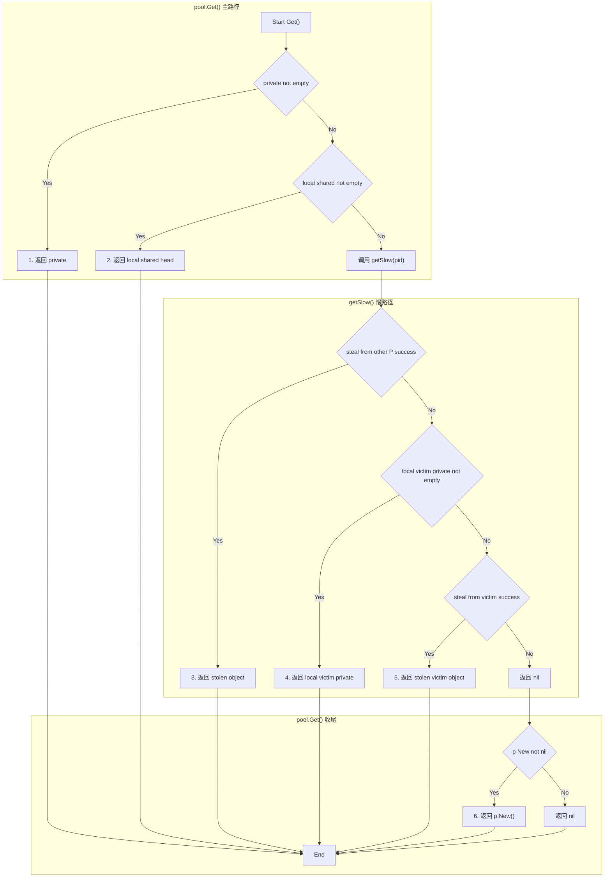
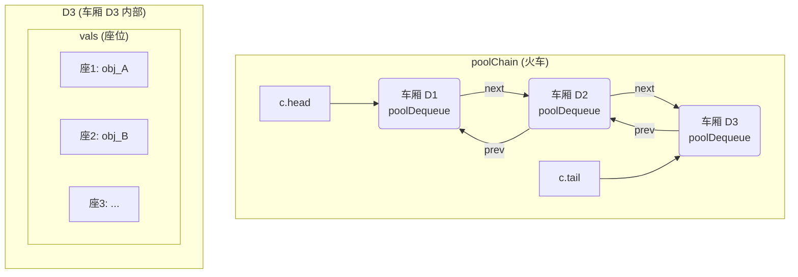
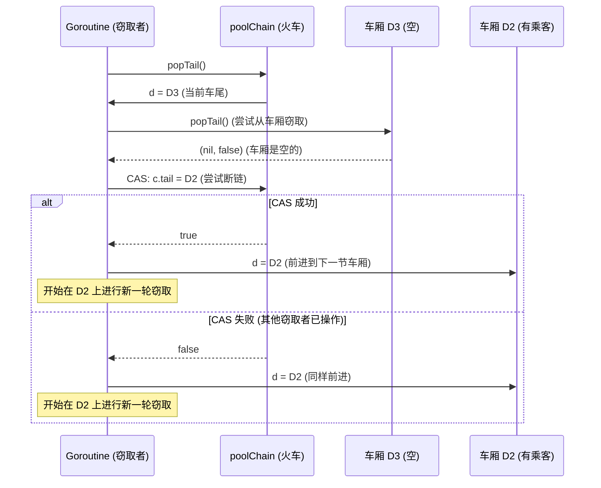

# sync.Pool 设计原理：一个“临时对象暂存区”的诞生

## 第一部分：核心“原罪”

> 在短时间内大量创建释放同一个类型的实例情况下，本地内存不够的话，大概率需要加锁获取新的内存。锁的调度和 gc 的压力将会是一个性能的问题。
>
> 现在需要有一个东西能够帮忙管理同类型实例。他需要拥有短时间多次使用的能力，同时时间长了他也需要被回收掉。

1.  **高性能复用**: 必须能够高效地“暂存”和“复用”对象，以避开内存分配的“锁调度”和对象释放的“GC 压力”。
2.  **可被回收**: 必须有一种机制，允许池中的对象在“长时间”不被使用后，能被 GC 无情地“回收”，以避免自身成为内存泄漏的根源。

本文档将以此为起点，通过“堆积木”的方式，逐步推导出 `sync.Pool` 的所有核心设计。

---

## 第二部分：初步探索：一个带锁的全局缓存

### 2.1 积木一：`slice + Mutex`

最直观的解决方案，就是用一个全局的 `slice`，配上一把 `Mutex` 互斥锁，来缓存对象。

**新问题（性能瓶颈）**: 这个设计虽然实现了“复用”，但它引入了一个巨大的“**全局锁竞争**”。在高度并发的场景下，所有试图 `Get` 或 `Put` 的 Goroutine 都必须在这把全局锁前排队。其性能，甚至可能比直接进行内存分配还要差。这个方案违背了我们“高性能”的初衷。

---

## 第三部分：核心进化：与调度器共舞的“本地化缓存”

既然“全局锁”是性能瓶颈，那么唯一的解决之道，就是“**去中心化**”。Go 的设计者们，选择了一条最大胆、也最高效的路：让 `Pool` 的设计，与 `G-M-P` 调度模型，进行“**深度绑定**”。

### 3.1 积木二：为每一个 `P` 设计一个“本地私有池”

**构建**：我们不再使用一个全局的池，而是为每一个处理器（`P`）都分配一个完全独立的、私有的“本地池”（`poolLocal`）。一个 Goroutine 在哪个 `P` 上运行，它就只访问哪个 `P` 的本地池。

**优势**：由于每个 `P` 同时只会运行一个 Goroutine，因此，Goroutine 在访问自己所在 `P` 的本地池时，是**完全不需要加任何锁**的。这就在理论上，解决了“锁竞争”的根本问题。

**新问题**：这个设计依赖于一个危险的假设：Goroutine 不会被“挪动”。但 Go 的调度器是抢占式的，一个 Goroutine 在执行 `Get` 或 `Put` 的过程中，完全有可能被调度器从 `P1` 抢走，然后放到 `P2` 上去运行。如果不对其进行保护，就会发生灾难性的数据竞争。

### 3.2 积木三：与 `runtime` 的“握手协议” - `pin` 机制

**需求**：我们必须有一种机制，能在一个极短的时间内，将 Goroutine “钉在”它所在的 `P` 上，禁止调度器对其进行抢占。

**构建**：`sync.Pool` 通过 `pin` 操作，与 `runtime` 达成了这样一个“秘密握手协议”：

1.  **`runtime_procPin()`**: 在访问本地池之前，调用此函数。它会给当前 Goroutine 打上一个“**不可抢占**”的标记，并安全地返回当前 `P` 的 ID (`pid`)。
2.  **安全访问**: 现在，我们可以用这个 `pid` 作为索引，绝对安全地、无锁地，访问那个只属于当前 `P` 的 `poolLocal`。
3.  **`runtime_procUnpin()`**: 访问完成后，立刻调用此函数，解除“不可抢占”标记，将 Goroutine “还给”调度器。

**优势**：`pin` 机制，以一种极低的成本（只是开关一个标记位），换来了对本地池的“**无锁访问**”权限。这是 `sync.Pool` 在绝大多数情况下，能够做到极致性能的、最核心的秘密。

#### 深度解析：`pin` 机制中的“内存屏障”

在 `pin` 函数的源码中，有两行看似普通、却生死攸关的代码：

```go
s := runtime_LoadAcquintptr(&p.localSize) // 指令 A
l := p.local                              // 指令 B
```

为了追求极致性能，现代 CPU 和编译器，都可能会对我们的代码进行“**指令重排**”。如果没有特殊保护，`指令 B` 完全有可能，被重排到 `指令 A` 之前执行。

这会带来灾难性的后果：一个 Goroutine 可能会读到一个**旧的、`nil` 的 `local` 指针**，和一个**新的、非零的 `localSize`**，最终导致程序崩溃。

`runtime_LoadAcquintptr` 这个函数，就是为了阻止这场灾难而存在的。它的名字中，最关键的部分是 `Acq` (Acquire)，它代表了一种“**内存获取语义**”，其本质，是在 CPU 和编译器层面，建立了一道“**内存屏障**” (Memory Barrier)。

这道屏障向系统下达了一个不可违背的命令：“**在我之后的所有内存读写操作（例如 `指令 B`），绝对不允许，被重排到我的前面去执行！**”

与之配对的，是在 `pinSlow` 函数中，写入 `localSize` 时使用的 `runtime_StoreReluintptr`。其名字中的 `Rel` (Release)，代表了“**内存释放语义**”。

`Acquire` 和 `Release` 语义共同保证了：**只要我们读到了一个新的、非零的 `p.localSize`，我们就必然能够读到那个在它之前被写入的、有效的 `p.local` 指针。**

这是一种极其底层的、手动的、为了在“无锁”的“无人区”中，保证数据可见性顺序的、最原始、也最高效的并发控制手段。

**个人理解**：这部分其实我也不懂哈哈哈哈，这部分的归类应该属于 GMP 出现所必要做的适配能力，可能不怎么需要出现在这里。可以跳过

---

## 第四部分：从“本地池”到“共享队列”的必然演进

至此，我们已经拥有了一个高性能的“本地池”（[poolLocal](https://github.com/golang/go/blob/release-branch.go1.24/src/sync/pool.go#L71-L77)）。它通过与调度器 `P` 的绑定，实现了无锁的本地存取。

但是，这个设计，依然存在一个“**自私**”缺陷：**每个 `P` 的本地池，都只为自己服务。**

这必然会导致两个严重的性能问题：
1.  **资源浪费**: 一个空闲的 `P`，可能会抱着一堆缓存的对象“睡大觉”，而另一个繁忙的 `P`，却因为本地池耗尽，被迫去高成本地创建新对象。
2.  **负载失衡**: 整个系统的对象缓存，无法在不同的 `P` 之间，进行有效的“负载均衡”。

因此，我们的设计，必须进入下一个、也是最终的演进阶段。

### 4.1 积木四：为“全局共享”而生的 `shared` 双端队列

**需求**：我们必须设计一种机制，允许一个 `P` 在耗尽自己本地资源时，能够去“**窃取**”其他 `P` 的富余资源。并且，这个“窃取”的过程，必须尽可能地减少竞争。

**构建**：[sync.Pool](https://github.com/golang/go/blob/release-branch.go1.24/src/sync/pool.go#L50-L63) 的设计者们，为每一个 [poolLocal](https://github.com/golang/go/blob/release-branch.go1.24/src/sync/pool.go#L71-L77)，都内置了一个名为 `shared` 的、并发安全的“**双端队列**”（`poolChain`）。

这个双端队列，被赋予了两条最核心、最精妙的访问规则：

1.  **本地 `P` (所有者)**: 拥有对队列“**头部**” (`pushHead` / `popHead`) 的、**无锁**的、独占式的访问权限。
2.  **其他 `P` (窃取者)**: 只拥有对队列“**尾部**” (`popTail`) 的、**加锁**的访问权限。

**优势**：这个设计，解决了“共享”与“竞争”之间的核心矛盾：
*   **减少热点**: 通过将“所有者”和“窃取者”的访问区域，在队列的两端进行物理隔离，它极大地降低了两者在同一时刻，对同一个内存地址进行操作的概率，从而将锁竞争的可能，降到了最低。

**逻辑推演**：至此，[Get](https://github.com/golang/go/blob/release-branch.go1.24/src/sync/pool.go#L122-L157) 操作的优先级链，已经变得清晰而深刻：
1.  **`private`**: 最高优先级。这是 `P` 的“私房钱”，完全无锁，成本最低。
2.  **`local.shared.popHead()`**: 第二优先级。这是 `P` 从自己的“共享账户”的头部，无锁地取钱。
3.  **`other.shared.popTail()`**: 第三优先级。在本地资源耗尽时，去其他 `P` 的“共享账户”的尾部，“窃取”一个最陈旧的对象。

### 4.2 积木五：与 GC 的“残酷契约” - `victim` 缓存与 [poolCleanup](https://github.com/golang/go/blob/release-branch.go1.24/src/sync/pool.go#L246-L280)

我们还剩下最后一个、也是最根本的问题没有解决：如何满足我们最初定下的第二条规约：“**时间长了他也需要被回收掉**”？

[sync.Pool](https://github.com/golang/go/blob/release-branch.go1.24/src/sync/pool.go#L50-L63) 的最终答案，是与 Go 的 GC，达成一个“**残酷的生死契约**”。

**构建**：
1.  **`victim` 缓存**: 每个 [Pool](https://github.com/golang/go/blob/release-branch.go1.24/src/sync/pool.go#L50-L63) 实例，除了 `local`（当前周期的本地池数组），还有一个 `victim`（上一周期的“受害者”缓存）。
2.  **[poolCleanup](https://github.com/golang/go/blob/release-branch.go1.24/src/sync/pool.go#L246-L280) 清洗**: 在每一轮 GC 开始时，`runtime` 都会调用 [poolCleanup](https://github.com/golang/go/blob/release-branch.go1.24/src/sync/pool.go#L246-L280) 函数。这个函数，会执行一次冷酷的“新陈代谢”：
    a. **抛弃“上上周期”**: 将所有 [Pool](https://github.com/golang/go/blob/release-branch.go1.24/src/sync/pool.go#L50-L63) 的 `victim` 缓存（它们是上一个 GC 周期留下来的）彻底清空，让其中的对象，被本轮 GC 回收。
    b. **降级“上周期”**: 将 `local` 数组，整体“降级”为新的 `victim` 缓存。
    c. **清空“本周期”**: 将 `local` 指针置为 `nil`，等待下一次 [pinSlow](https://github.com/golang/go/blob/release-branch.go1.24/src/sync/pool.go#L222-L244) 时，重新创建。

**最终的优先级链**:
这个“残酷契约”，为我们 [Get](https://github.com/golang/go/blob/release-branch.go1.24/src/sync/pool.go#L122-L157) 操作的优先级链，补上了最后、也是最低的两环：
4.  **`local.victim`**: 在连“窃取”都失败后，最后的希望，是看看自己**上个周期**留下的 `victim` 缓存里，是否还有“幸存者”。
5.  **`other.victim`**: 如果连自己的 `victim` 都空了，[sync.Pool](https://github.com/golang/go/blob/release-branch.go1.24/src/sync/pool.go#L50-L63) **不会**去窃取其他 `P` 的 `victim`。因为它认为，这些“老古董”之所以能存活到现在，就是因为没人用。强行“复活”它们，只会增加 GC 的负担。此时，它会选择放弃，返回 `nil`，并最终通过 `p.New()` 创建一个全新的对象。



---

至此，我们已经从“本地池的自私缺陷”出发，完整地推导出了 [sync.Pool](https://github.com/golang/go/blob/release-branch.go1.24/src/sync/pool.go#L50-L63) 内部，那个充满了“共享”、“竞争”、“时间”与“生命周期”权衡的、冷酷而高效的终极形态。

---

## 附录：`poolChain` - 一个“尽力而为”的、由“车厢”组成的无锁“火车”

`sync.Pool` `poolLocal` 的 `shared` 字段，它并非一个简单的队列，而是一个“**由双端队列（`poolDequeue`）组成的无锁链表**”，即 `poolChain`。

### 结构解析：“火车”、“车厢”与“座位”

为了彻底理解这个设计，我们可以使用一个“火车”的比喻：

1.  **`poolChain` (链表)**: 是整列“**火车**”。它有 `head` 指向“车头”，`tail` 指向“车尾”。
2.  **`poolDequeue` (双端队列)**: 是火车上的一节一节的“**车厢**”。每一节“车厢”，都是一个固定大小的、存放对象的“环形缓冲区”。
3.  **`vals` 数组**: 是“车厢”内部的一排排“**座位**”，实际存储着 `pool` 中的对象。

`pushHead` 的行为，就像是在火车头不断增加新的“车厢”；而 `popTail` 的行为，则是在火车尾，尝试从“车厢”中带走乘客。



### `popTail` 行为模拟：“断链”与“前进”

`popTail` 的 `for` 循环，是在实现一个“在链表中行进的、寻找非空车厢的遍历器”。

当一个“窃取者”调用 `popTail`，并发现当前的“车尾车厢”（例如 `D3`）是空的时，它会尝试做两件事：
1.  **“断链”**: 尝试通过 `CAS`，将火车的 `tail` 指针，从 `D3` 移动到 `D2`，将 `D3` 这节空车厢“摘除”。
2.  **“前进”**: 无论“断链”是否成功，它都会将自己的目标，移到 `D2`，并在 `D2` 上，开始新一轮的“窃取”尝试。



### 核心哲学：“尽力而为”的窃取

`popTail` 的 `for` 循环，并**不保证**能一次性遍历完所有车厢。`getSlow` 函数对每个 `P` 的 `shared` 队列，都只会“蜻蜓点水”般地调用**一次** `popTail`。

这是一种极其重要的“**防御性设计**”，其本质是一种“**尽力而为，但不保证单次成功**”的哲学，目的是为了避免在某一个竞争激烈的“热点车厢”上，陷入“活锁”（Livelock）而导致性能雪崩。

它放弃了对单个 `P` 的“深度压榨”，换取了对所有 `P` 的“广度优先”的、公平的窃取机会，最终保证了整个 `sync.Pool` 系统的宏观稳定性和公平性。