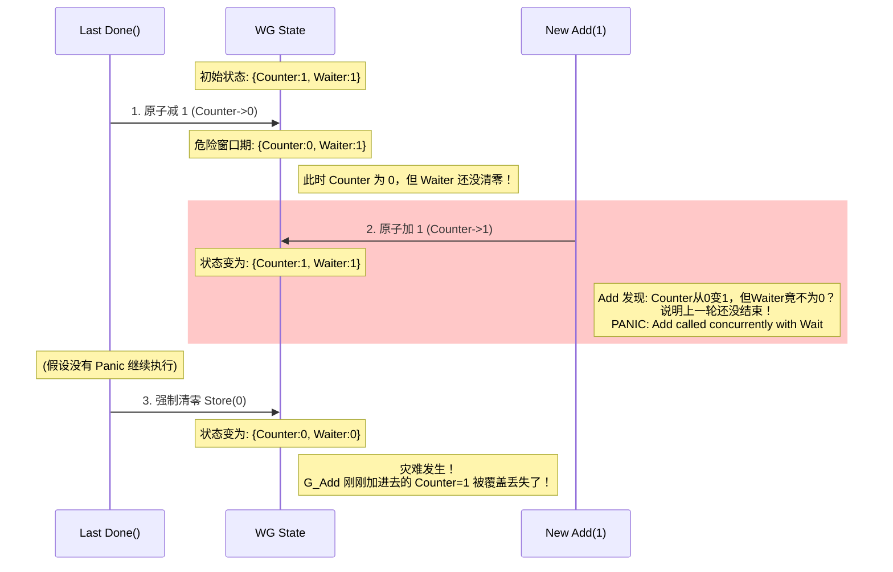

# sync.WaitGroup 设计推演：从计数器到并发编排

本文档旨在从第一性原理出发，推导出 Go `sync.WaitGroup` 的核心设计。我们将从一个最简单的需求开始，逐步解决并发场景下的竟态问题，最终构建出标准库级别的实现。

---

## 第一部分：需求与原型 (The Origin)

### 1.1 问题的诞生：Fork-Join 模型

在并发编程中，最基础也是最高频的模式是 **Fork-Join（分叉-合并）**：
1.  **Fork**: 主程序派发出 N 个子任务（goroutine）去并发执行。
2.  **Join**: 主程序在终点线等待，必须等这 N 个子任务全部完成后，才能继续向下执行。

如果没有专门的工具，我们只能用 `channel` 强行实现：

```go
func main() {
    done := make(chan bool)
    for i := 0; i < 10; i++ {
        go func() {
            // do work...
            done <- true // 汇报
        }()
    }
    // 必须精确等待 10 次
    for i := 0; i < 10; i++ {
        <-done
    }
}
```

这种做法有三个痛点：
1.  **认知负担**: 必须手动管理循环次数，容易出错（死锁或提前返回）。
2.  **性能损耗**: 创建 channel 和读写 channel 的开销，远大于简单的原子计数。
3.  **语义不清**: channel 强调的是“数据通信”，而我们需要的仅仅是“控制流信号”。

### 1.2 为什么不复用 sync.Cond？

Go 已经有了 `sync.Cond`，它拥有强大的 `Broadcast`（广播）能力，看似完美契合“唤醒所有人”的需求。
我们可以用 `Cond` 实现一个功能完备的 WaitGroup：

```go
type WaitGroupWithCond struct {
    mu      sync.Mutex
    counter int
    cond    *sync.Cond
}

func (wg *WaitGroupWithCond) Add(delta int) {
    wg.mu.Lock() // 每次操作都必须加锁
    wg.counter += delta
    if wg.counter == 0 {
        wg.cond.Broadcast() // 状态改变，广播全场
    }
    wg.mu.Unlock()
}

func (wg *WaitGroupWithCond) Wait() {
    wg.mu.Lock()
    for wg.counter > 0 {
        wg.cond.Wait()
    }
    wg.mu.Unlock()
}
```

**既然能用，为什么要造新轮子？**

这就触及了 WaitGroup 存在的根本原因——**语义特化与性能压榨**。

1.  **语义的差异 (Completion vs Notification)**
    *   `Cond` 是**非确定性**的通知。它的语义是：“状态变了，大家醒醒再看看”。它关注的是**状态 (State)**。
    *   `WaitGroup` 是**确定性**的倒计时。它的语义是：“任务归零，放行”。它关注的是**数量 (Quantity)**。

2.  **性能的鸿沟 (Lock vs CAS)**
    *   `Cond` 基于 `Mutex`。这意味着每次 `Add` 和 `Done` 都必须加锁。在“派发百万级小任务”的极端场景下，锁竞争会成为瓶颈。
    *   Fork-Join 场景非常单纯，单纯到只需要一个原子计数器。
    *   **为了这个高频场景，值得专门设计一个基于 CAS（无锁）的轻量级原语。**

### 1.3 核心设计目标

基于以上推演，我们对 `WaitGroup` 提出了极其苛刻的设计目标：
1.  **极致轻量**: 在没有发生阻塞（Wait）的时候，`Add` 和 `Done` 必须几乎等同于几条 CPU 指令（原子操作），坚决不加锁。
2.  **无内存分配**: 热路径上不能有动态内存分配。

这就逼出了那个经典的设计决策：**将计数器与信号量剥离，优先使用原子操作。**

---

## 第二部分：无锁演进 (The Lock-Free Evolution)

### 2.1 积木一：原子计数器

我们可以尝试把 `counter` 换成原子变量 `int32`。

```go
type WaitGroupV2 struct {
    counter int32
}

func (wg *WaitGroupV2) Add(delta int) {
    atomic.AddInt32(&wg.counter, int32(delta))
    // 如果变成0，怎么通知 Wait？
}

func (wg *WaitGroupV2) Wait() {
    for atomic.LoadInt32(&wg.counter) > 0 {
        // 忙等待？不行，会烧光 CPU
        runtime.Gosched() 
    }
}
```

**新问题**: 
1.  **如何睡眠**: `Wait` 不能忙等待，必须挂起（Sleep）。
2.  **如何唤醒**: 当 `counter` 归零时，`Done` 操作需要知道“有没有人在等待”，如果有，得去唤醒它们。

这意味着，我们需要维护**两个状态**：
1.  `counter`: 还有多少个任务没做完？
2.  `waiters`: 有多少个 goroutine 在调用 `Wait` 等待？

### 2.2 积木二：复合状态 (The State Merging)

Go `WaitGroup` 使用了一个 `uint64` 来存储这两个状态：
*   **高 32 位**: `counter` (任务计数器)
*   **低 32 位**: `waiter` (等待者计数器)

```go
state := atomic.LoadUint64(&wg.state)
counter := int32(state >> 32)
waiter  := uint32(state)
```

这样，我们就可以用一次 `CAS` (Compare-And-Swap) 操作，同时判断并修改这两个值。

---

## 第三部分：核心逻辑推演

我们引入一个信号量 `sema` 用于睡眠和唤醒。

### 3.1 `Add` / `Done` 的逻辑

`Add(delta)` 的核心任务是更新 `counter`。

1.  **原子更新**: 将 `delta` 加到高 32 位上。
    `state = atomic.AddUint64(&wg.state, uint64(delta) << 32)`
2.  **判断归零**: 
    *   如果 `counter > 0`: 说明还有任务，直接返回。
    *   如果 `counter < 0`: **Panic** (负数计数器是不允许的)。
    *   如果 `counter == 0`: **时刻到了**。需要检查低 32 位的 `waiter`。
3.  **唤醒逻辑**:
    *   如果 `waiter > 0`: 说明有人在等。我们需要唤醒这 `waiter` 个 goroutine。
    *   **关键一步**: 在唤醒之前，必须将 `state` 清零（也就是把 `waiter` 清零）。为什么？为了防止“重用”时的竞态（后面详述）。
    *   循环调用 `runtime_Semrelease(&wg.sema)`，唤醒所有等待者。

### 3.2 `Wait` 的逻辑

`Wait` 的核心任务是：如果 `counter > 0`，就把自己注册为 `waiter`，然后睡觉。

这是一个经典的 **CAS 循环**：

1.  **读取状态**: `state := wg.state.Load()`
2.  **快速检查**: 如果高 32 位的 `counter == 0`，直接返回（不用等了）。
3.  **尝试注册**: 
    *   试图通过 CAS，将 `state` 加 1 (低 32 位的 `waiter` 加 1)。
    *   `atomic.CompareAndSwapUint64(&state, state, state+1)`
4.  **失败重试**: 如果 CAS 失败（说明中间有人调用了 Add 或 Wait），回到第 1 步重试。
5.  **成功睡眠**: 
    *   如果 CAS 成功，说明我已经把自己记录在案了。
    *   调用 `runtime_Semacquire(&wg.sema)`，进入睡眠。
    *   （醒来后）检查是否被正常唤醒。

---

## 第四部分：工程实现的暗坑

### 4.1 内存对齐的诅咒 (The Alignment Curse)

在 64 位架构上，`uint64` 是自然对齐的，原子操作没问题。
但在 32 位架构上，编译器不能保证 `uint64` 变量是 8 字节对齐的。如果不对齐，原子操作会 Panic 或出错。

**Go (旧版本) 的黑魔法**:
为了兼容 32 位机器，`WaitGroup` 曾经的结构体设计非常诡异：

```go
type WaitGroup struct {
    noCopy noCopy
    // 12 个字节，包含 state(8) + sema(4)。
    // 但我们不知道这 12 个字节在内存里是怎么对齐的。
    state1 [12]byte 
}
```

代码里会动态判断 `state1` 的地址是否是 8 字节对齐：
*   如果对齐了，就用前 8 个字节做 `state`，后 4 个做 `sema`。
*   如果没对齐，就跳过前 4 个字节（作为 Padding），用中间 8 个做 `state`，最后 4 个（或最前 4 个）做 `sema`。

*注：在 Go 1.18+ 引入 `atomic.Uint64` 后，编译器会自动处理对齐，代码变得清爽了，但这个历史包袱体现了底层编程的艰难。*

### 4.2 “重用”的死亡陷阱 (The Reuse Trap)

官方文档严厉警告：**不要并发地重用 WaitGroup。** 即：在前一组 `Wait` 返回之前，绝对不能调用下一组的 `Add`。

**为什么？** 这是一个典型的“清场不彻底”导致的竞态。

当最后一个 `Done` 被调用时，它需要做两件事：
1.  把 `counter` 减为 0。
2.  把 `waiter` 清为 0（状态复位），并唤醒等待者。

如果在第 1 步和第 2 步之间，有人调用了 `Add`，就会发生灾难。



**这个 Panic 的本质是保护机制**：它阻止了 Step 3 的发生。如果允许程序继续跑，G_Add 增加的任务会被 G_Done 的清场逻辑无声无息地抹掉，导致更严重的逻辑 Bug（如新任务永远不会被等待）。

---


## 附录：32 位对齐的“黑魔法” (The Alignment Magic)

*注：本节内容主要针对 Go 1.18 之前的版本。虽然现在的标准库已经封装了这些细节，但理解它对于深入掌握内存模型极其有益。*
*注：下面这些 个人并没有深入研究过。

### A.1 问题：卡车与车位

在 32 位架构（如 x86, ARMv7）上，编译器通常保证变量按 **4 字节对齐**。
但是，64 位的原子操作（`atomic.AddUint64` 等）在这些硬件上通常要求变量必须按 **8 字节对齐**。

这就带来了一个棘手的问题：
如果我们在结构体里直接声明 `state uint64`，编译器可能把它放在一个 4 字节对齐但非 8 字节对齐的地址上（比如地址 `0x1004`）。一旦对这个地址执行原子操作，程序在某些 CPU 上会直接 Crash，或者抛出 Panic。

### A.2 方案：动态漂移

Go 语言团队为了节省内存（避免专门去堆上 `new` 一块对齐的内存），想出了一个绝妙的 **“填充法”**。

他们在 `WaitGroup` 中定义了一个 12 字节的数组（而不是 8+4）：

```go
type WaitGroup struct {
    noCopy noCopy
    // 64位状态 + 32位信号量 = 12 字节
    // 但我们不知道它的起始地址能不能被 8 整除
    state1 [12]byte 
}
```

在使用时，他们通过指针运算，动态决定哪 8 个字节用来存 `state`，哪 4 个字节用来存 `sema`。

#### 核心代码逻辑（伪代码）：

```go
func (wg *WaitGroup) state() (statep *uint64, semap *uint32) {
    addr := uintptr(unsafe.Pointer(&wg.state1))
    
    // 核心判断：地址能否被 8 整除？
    if addr % 8 == 0 {
        // 情况一：运气好，刚好 8 字节对齐
        // state1: [ 0 1 2 3 4 5 6 7 ] [ 8 9 10 11 ]
        //           ^ state (8 bytes)   ^ sema (4 bytes)
        return (*uint64)(pointer(addr)), (*uint32)(pointer(addr + 8))
    } else {
        // 情况二：没对齐（通常是差 4 字节，addr % 8 == 4）
        // 此时，我们将前 4 个字节废弃（作为 Padding），用后面的 8 个字节
        // state1: [ padding ] [ 0 1 2 3 4 5 6 7 ]
        //           ^ sema      ^ state (8 bytes)
        // 
        // 等等！为了不浪费，我们可以把 sema 塞到前面的 padding 里！
        return (*uint64)(pointer(addr + 4)), (*uint32)(pointer(addr))
    }
}
```

### A.3 视觉演示

**Case 1: 起始地址 0x1000 (已对齐)**

```text
内存地址: 0x1000  0x1004  0x1008  0x100C
内容:     [ State Low ][ State High ][ Sema ][ unused ]
          ^ State 指针                ^ Sema 指针
```

**Case 2: 起始地址 0x1004 (未对齐)**

```text
内存地址: 0x1004  0x1008  0x100C  0x1010
内容:     [ Sema ][ State Low ][ State High ]
          ^ Sema  ^ State 指针 (0x1008, 完美对齐!)
```

**总结**：
通过多申请 4 个字节（总共 12 字节），无论起始地址在何处，我们总能在这个数组里找到一个 **连续的、8 字节对齐的** 8 字节空间来存放 `state`。剩下的 4 字节刚好给 `sema`。

这种**以空间换对齐**的技巧，是系统编程中处理内存布局限制的经典案例。
